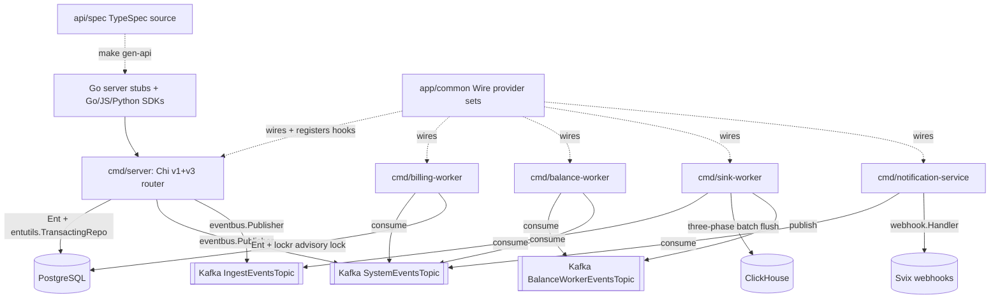

# AGENTS.md

> Architecture guidance for **Unknown Repository**
> Style: Single Go monorepo producing seven independently deployable binaries from shared domain packages under openmeter/. Strict three-layer domain pattern (service interface at domain root, concrete service in service/, Ent/PostgreSQL adapter in adapter/, HTTP handlers in httpdriver/ or httphandler/). Google Wire DI with all provider sets in app/common/. TypeSpec as single source of truth for dual API versions (v1 via Chi+kin-openapi, v3 via Chi+oasmiddleware). Kafka three-topic event bus via Watermill for async cross-binary events. Ent ORM + Atlas-managed migrations for PostgreSQL; ClickHouse for usage event analytics.
> Generated: 2026-05-14T19:45:41.182782+00:00

## Overview

OpenMeter is a Go monorepo metering and billing platform with seven binaries sharing domain packages under openmeter/. The architecture enforces a three-layer domain pattern (service interface / concrete service / Ent adapter), Google Wire DI composition in app/common/, and TypeSpec-as-source-of-truth for all HTTP API contracts. Async cross-binary coordination uses a Kafka three-topic event bus via Watermill, with Ent+Atlas handling PostgreSQL persistence and ClickHouse for usage event analytics.

## Architecture

**Style:** All business logic lives in leaf domain packages under openmeter/ (38 components: billing, customer, entitlement, subscription, notification, ledger, meter, ingest, sink, streaming, etc.), each following a strict three-layer shape (Service interface at package root, concrete service in service/, Ent-backed Adapter in adapter/, HTTP in httpdriver/ or httphandler/). Seven cmd/* entrypoints (server, billing-worker, balance-worker, sink-worker, notification-service, jobs, benthos-collector) each call their own Wire-generated initializeApplication; reusable provider sets are concentrated in app/common/ (one file per domain plus openmeter_<binary>.go per-binary sets). The HTTP contract is authored once in TypeSpec (api/spec/) and compiled to dual API versions (v1 via openmeter/server/router + kin-openapi, v3 via api/v3/server + oasmiddleware) plus Go/JS/Python SDKs. PostgreSQL via Ent ORM + Atlas migrations is the system of record; ClickHouse stores usage events; Kafka via Watermill (openmeter/watermill/eventbus) is the async backbone with three name-prefix-routed topics.
**Structure:** modular

High-volume per-tenant usage ingestion (sink-worker), entitlement balance recalculation (balance-worker), billing lifecycle advancement (billing-worker), and webhook dispatch (notification-service) have fundamentally different scaling and failure profiles, so they must be independently deployable. But billing correctness across charges, ledger, and invoices demands one typed domain model with compile-time-checked relations across ~60 Ent entities. The monorepo + shared-domain-packages choice keeps the single type system; Wire makes each binary's provider graph compile-time verified; TypeSpec-as-source eliminates SDK drift across three languages and two API versions; Ent+Atlas couples schema and Go types; Kafka+Watermill decouples the workers. Cross-domain reactions (billing reacting to customer lifecycle, ledger reacting to customer creation) are mediated by ServiceHookRegistry and RequestValidator registries registered as side-effects in app/common to keep domain packages as import-cycle-free leaves.

**Root constraint:** Operate a high-volume per-tenant usage-metering platform that feeds strict financial billing correctness, while shipping stable SDKs in three languages — under a single small team that cannot maintain separate repos or hand-synchronized contracts.
- → Split the runtime into seven independently deployable binaries (cmd/server + five workers + jobs CLI + benthos-collector) that share one domain-package tree under openmeter/.
- → Author the entire HTTP surface once in TypeSpec (api/spec/) and generate both v1 and v3 OpenAPI specs, Go server stubs, and Go/JS/Python SDKs.
- → Persist to PostgreSQL via Ent ORM with Atlas-managed migrations, accessed through context-propagated transactions (entutils.TransactingRepo) and per-customer pg_advisory_xact_lock via lockr.

**Key trade-offs:**
- Ent-generated query friction: a large openmeter/ent/db/ generated tree, slower compile times, and the boilerplate Tx/WithTx/Self triad plus a TransactingRepo wrapper on every adapter method body. → Compile-time-checked relations across ~60 entities, automatic Atlas schema diffing, no runtime schema surprises, and ctx-propagated transactions with savepoint nesting.
- Multi-binary orchestration cost: seven Docker image variants, Helm values complexity, and a separate Wire graph per binary that must each be kept complete. → Independent horizontal scaling of sink-worker / balance-worker / billing-worker, fault isolation per binary, and isolated deploy cadence.
- Two-step regeneration cadence: TypeSpec changes require both `make gen-api` AND `make generate`, and five independent generators (oapi-codegen, Ent, Wire, Goverter, Goderive) write different artifacts that must all stay in sync. → Cross-language SDK contracts cannot drift — Go server stubs, Go SDK, JS SDK, Python SDK all originate from a single TypeSpec source.

**Runs on:** self-hosted
**Compute:** cmd/server — Main HTTP API server (openmeter binary), cmd/sink-worker — Kafka→ClickHouse sink (openmeter-sink-worker binary), cmd/balance-worker — Entitlement balance recalculation (openmeter-balance-worker binary), cmd/billing-worker — Billing lifecycle worker (openmeter-billing-worker binary), cmd/notification-service — Webhook/notification dispatcher (openmeter-notification-service binary), cmd/jobs — Admin CLI for one-off jobs (openmeter-jobs binary), cmd/benthos-collector — Benthos event pipeline (benthos binary, separate image)
**CI/CD:** GitHub Actions (ci.yaml) — Build, lint, test on every push/PR using Nix .#ci shell on Depot runners, GitHub Actions (release.yaml) — Publishes Docker images to GHCR, Helm charts to GHCR OCI, npm @openmeter/sdk, Python SDK on version tags, GitHub Actions (artifacts.yaml) — Reusable workflow: builds and pushes multi-platform images (linux/amd64, linux/arm64) via Depot, GitHub Actions (npm-release.yaml) — Reusable: publishes @openmeter/sdk to npm via OIDC trusted publishing, GitHub Actions (pr-checks.yaml) — Enforces release-note label on every PR, GitHub Actions (security.yaml) — Trufflehog secret scanning + SCA (syft); fail_on_findings=true, GitHub Actions (analysis-scorecard.yaml) — OpenSSF Scorecard analysis weekly (Fridays) and on main push, GitHub Actions (sdk-python-dev-release.yaml) — Python SDK beta release on main push and workflow_dispatch, GitHub Actions (require-all-reviewers.yml) — Enforces all requested reviewers approve when PR has require-all-reviewers label, GitHub Actions (workflow-result.yaml) — Reusable required-check pass/fail aggregator, GitHub Actions (untrusted-artifacts.yaml) — Builds container image without publishing for PR safety, GitHub Actions (codeql-go.yaml) — CodeQL analysis for Go, GitHub Actions (codeql.yml) — CodeQL analysis

## Architecture Diagram



## Commands

```bash
# up
docker compose up -d
# fmt
golangci-lint run --fix
# test
POSTGRES_HOST=127.0.0.1 go test -p 128 -parallel 16 -tags=dynamic ./...
# lint
make lint-go lint-api-spec lint-openapi lint-helm
# build
go build -o build/ -tags=dynamic ./cmd/...
# server
air -c ./cmd/server/.air.toml
# lint-go
golangci-lint run -v ./...
# test-all
docker compose up -d postgres svix redis && SVIX_HOST=localhost go test -p 128 -parallel 16 -tags=dynamic -count=1 ./...
```

_Full catalog (42 commands) in [`.claude/rules/technology.md`](.claude/rules/technology.md)._

## Architectural Rules

Detailed rules live as topic files under `.claude/rules/`. Read the relevant one when the task touches that surface:

- [`.claude/rules/architecture.md`](.claude/rules/architecture.md) — Components, file placement, naming conventions
- [`.claude/rules/patterns.md`](.claude/rules/patterns.md) — Communication patterns, integrations, key decisions, trade-offs (with violation signals)
- [`.claude/rules/technology.md`](.claude/rules/technology.md) — Tech stack, project structure, code templates, testing tooling
- [`.claude/rules/guidelines.md`](.claude/rules/guidelines.md) — Implementation guidelines for existing capabilities
- [`.claude/rules/pitfalls.md`](.claude/rules/pitfalls.md) — Documented traps with evidence + fix direction
- [`.claude/rules/dev-rules.md`](.claude/rules/dev-rules.md) — Coding-time imperatives (patterns, anti-patterns, boundaries, wiring)
- [`.claude/rules/infrastructure.md`](.claude/rules/infrastructure.md) — CI / signing / distribution / secrets / env setup / registry auth
- [`.claude/rules/enforcement/index.md`](.claude/rules/enforcement/index.md) — Every rule the pre-edit hook + plan/commit classifier consults, grouped by severity

## Enforcement Rules

[`.claude/rules/enforcement/index.md`](.claude/rules/enforcement/index.md) indexes every rule, grouped by topic and by path glob. Load only the topic file(s) relevant to the file you're editing — universal anti-patterns sit in `enforcement/universal.md`. The pre-edit hook (`PRE_VALIDATE_HOOK`) and plan/commit classifier (`align_check.py`) read [`.archie/rules.json`](.archie/rules.json) directly; the markdown is for agent/human browsing only.

## Per-folder Context

Every meaningful folder has its own `CLAUDE.md` (Archie's intent layer). Claude Code auto-loads the nearest one, so when editing a file under `some/component/`, look there first for the local invariants, anti-patterns, and adjacent code that uses the same shape.

---
*Auto-generated from structured architecture analysis. Place in project root.*

<!-- archie:generated:start -->
<!-- Regenerated by Archie on 2026-05-14T19:59Z. Edits between the archie:generated markers will be overwritten; edit outside them to keep changes. -->

# AGENTS.md

> Architecture guidance for **Unknown Repository**
> Style: Single Go monorepo producing seven independently deployable binaries from shared domain packages under openmeter/. Strict three-layer domain pattern (service interface at domain root, concrete service in service/, Ent/PostgreSQL adapter in adapter/, HTTP handlers in httpdriver/ or httphandler/). Google Wire DI with all provider sets in app/common/. TypeSpec as single source of truth for dual API versions (v1 via Chi+kin-openapi, v3 via Chi+oasmiddleware). Kafka three-topic event bus via Watermill for async cross-binary events. Ent ORM + Atlas-managed migrations for PostgreSQL; ClickHouse for usage event analytics.
> Generated: 2026-05-14T19:59:55.106876+00:00

## Overview

OpenMeter is a Go monorepo metering and billing platform with seven binaries sharing domain packages under openmeter/. The architecture enforces a three-layer domain pattern (service interface / concrete service / Ent adapter), Google Wire DI composition in app/common/, and TypeSpec-as-source-of-truth for all HTTP API contracts. Async cross-binary coordination uses a Kafka three-topic event bus via Watermill, with Ent+Atlas handling PostgreSQL persistence and ClickHouse for usage event analytics.

## Architecture

**Style:** All business logic lives in leaf domain packages under openmeter/ (38 components: billing, customer, entitlement, subscription, notification, ledger, meter, ingest, sink, streaming, etc.), each following a strict three-layer shape (Service interface at package root, concrete service in service/, Ent-backed Adapter in adapter/, HTTP in httpdriver/ or httphandler/). Seven cmd/* entrypoints (server, billing-worker, balance-worker, sink-worker, notification-service, jobs, benthos-collector) each call their own Wire-generated initializeApplication; reusable provider sets are concentrated in app/common/ (one file per domain plus openmeter_<binary>.go per-binary sets). The HTTP contract is authored once in TypeSpec (api/spec/) and compiled to dual API versions (v1 via openmeter/server/router + kin-openapi, v3 via api/v3/server + oasmiddleware) plus Go/JS/Python SDKs. PostgreSQL via Ent ORM + Atlas migrations is the system of record; ClickHouse stores usage events; Kafka via Watermill (openmeter/watermill/eventbus) is the async backbone with three name-prefix-routed topics.
**Structure:** modular

High-volume per-tenant usage ingestion (sink-worker), entitlement balance recalculation (balance-worker), billing lifecycle advancement (billing-worker), and webhook dispatch (notification-service) have fundamentally different scaling and failure profiles, so they must be independently deployable. But billing correctness across charges, ledger, and invoices demands one typed domain model with compile-time-checked relations across ~60 Ent entities. The monorepo + shared-domain-packages choice keeps the single type system; Wire makes each binary's provider graph compile-time verified; TypeSpec-as-source eliminates SDK drift across three languages and two API versions; Ent+Atlas couples schema and Go types; Kafka+Watermill decouples the workers. Cross-domain reactions (billing reacting to customer lifecycle, ledger reacting to customer creation) are mediated by ServiceHookRegistry and RequestValidator registries registered as side-effects in app/common to keep domain packages as import-cycle-free leaves.

**Root constraint:** Operate a high-volume per-tenant usage-metering platform that feeds strict financial billing correctness, while shipping stable SDKs in three languages — under a single small team that cannot maintain separate repos or hand-synchronized contracts.
- → Split the runtime into seven independently deployable binaries (cmd/server + five workers + jobs CLI + benthos-collector) that share one domain-package tree under openmeter/.
- → Author the entire HTTP surface once in TypeSpec (api/spec/) and generate both v1 and v3 OpenAPI specs, Go server stubs, and Go/JS/Python SDKs.
- → Persist to PostgreSQL via Ent ORM with Atlas-managed migrations, accessed through context-propagated transactions (entutils.TransactingRepo) and per-customer pg_advisory_xact_lock via lockr.

**Key trade-offs:**
- Ent-generated query friction: a large openmeter/ent/db/ generated tree, slower compile times, and the boilerplate Tx/WithTx/Self triad plus a TransactingRepo wrapper on every adapter method body. → Compile-time-checked relations across ~60 entities, automatic Atlas schema diffing, no runtime schema surprises, and ctx-propagated transactions with savepoint nesting.
- Multi-binary orchestration cost: seven Docker image variants, Helm values complexity, and a separate Wire graph per binary that must each be kept complete. → Independent horizontal scaling of sink-worker / balance-worker / billing-worker, fault isolation per binary, and isolated deploy cadence.
- Two-step regeneration cadence: TypeSpec changes require both `make gen-api` AND `make generate`, and five independent generators (oapi-codegen, Ent, Wire, Goverter, Goderive) write different artifacts that must all stay in sync. → Cross-language SDK contracts cannot drift — Go server stubs, Go SDK, JS SDK, Python SDK all originate from a single TypeSpec source.

**Runs on:** self-hosted
**Compute:** cmd/server — Main HTTP API server (openmeter binary), cmd/sink-worker — Kafka→ClickHouse sink (openmeter-sink-worker binary), cmd/balance-worker — Entitlement balance recalculation (openmeter-balance-worker binary), cmd/billing-worker — Billing lifecycle worker (openmeter-billing-worker binary), cmd/notification-service — Webhook/notification dispatcher (openmeter-notification-service binary), cmd/jobs — Admin CLI for one-off jobs (openmeter-jobs binary), cmd/benthos-collector — Benthos event pipeline (benthos binary, separate image)
**CI/CD:** GitHub Actions (ci.yaml) — Build, lint, test on every push/PR using Nix .#ci shell on Depot runners, GitHub Actions (release.yaml) — Publishes Docker images to GHCR, Helm charts to GHCR OCI, npm @openmeter/sdk, Python SDK on version tags, GitHub Actions (artifacts.yaml) — Reusable workflow: builds and pushes multi-platform images (linux/amd64, linux/arm64) via Depot, GitHub Actions (npm-release.yaml) — Reusable: publishes @openmeter/sdk to npm via OIDC trusted publishing, GitHub Actions (pr-checks.yaml) — Enforces release-note label on every PR, GitHub Actions (security.yaml) — Trufflehog secret scanning + SCA (syft); fail_on_findings=true, GitHub Actions (analysis-scorecard.yaml) — OpenSSF Scorecard analysis weekly (Fridays) and on main push, GitHub Actions (sdk-python-dev-release.yaml) — Python SDK beta release on main push and workflow_dispatch, GitHub Actions (require-all-reviewers.yml) — Enforces all requested reviewers approve when PR has require-all-reviewers label, GitHub Actions (workflow-result.yaml) — Reusable required-check pass/fail aggregator, GitHub Actions (untrusted-artifacts.yaml) — Builds container image without publishing for PR safety, GitHub Actions (codeql-go.yaml) — CodeQL analysis for Go, GitHub Actions (codeql.yml) — CodeQL analysis

## Architecture Diagram


## Commands

```bash
# up
docker compose up -d
# fmt
golangci-lint run --fix
# test
POSTGRES_HOST=127.0.0.1 go test -p 128 -parallel 16 -tags=dynamic ./...
# lint
make lint-go lint-api-spec lint-openapi lint-helm
# build
go build -o build/ -tags=dynamic ./cmd/...
# server
air -c ./cmd/server/.air.toml
# lint-go
golangci-lint run -v ./...
# test-all
docker compose up -d postgres svix redis && SVIX_HOST=localhost go test -p 128 -parallel 16 -tags=dynamic -count=1 ./...
```

_Full catalog (42 commands) in [`.claude/rules/technology.md`](.claude/rules/technology.md)._

## Architectural Rules

Detailed rules live as topic files under `.claude/rules/`. Read the relevant one when the task touches that surface:

- [`.claude/rules/architecture.md`](.claude/rules/architecture.md) — Components, file placement, naming conventions
- [`.claude/rules/patterns.md`](.claude/rules/patterns.md) — Communication patterns, integrations, key decisions, trade-offs (with violation signals)
- [`.claude/rules/technology.md`](.claude/rules/technology.md) — Tech stack, project structure, code templates, testing tooling
- [`.claude/rules/guidelines.md`](.claude/rules/guidelines.md) — Implementation guidelines for existing capabilities
- [`.claude/rules/pitfalls.md`](.claude/rules/pitfalls.md) — Documented traps with evidence + fix direction
- [`.claude/rules/dev-rules.md`](.claude/rules/dev-rules.md) — Coding-time imperatives (patterns, anti-patterns, boundaries, wiring)
- [`.claude/rules/infrastructure.md`](.claude/rules/infrastructure.md) — CI / signing / distribution / secrets / env setup / registry auth
- [`.claude/rules/enforcement/index.md`](.claude/rules/enforcement/index.md) — Every rule the pre-edit hook + plan/commit classifier consults, grouped by severity

## Enforcement Rules

[`.claude/rules/enforcement/index.md`](.claude/rules/enforcement/index.md) indexes every rule, grouped by topic and by path glob. Load only the topic file(s) relevant to the file you're editing — universal anti-patterns sit in `enforcement/universal.md`. The pre-edit hook (`PRE_VALIDATE_HOOK`) and plan/commit classifier (`align_check.py`) read [`.archie/rules.json`](.archie/rules.json) directly; the markdown is for agent/human browsing only.

## Per-folder Context

Every meaningful folder has its own `CLAUDE.md` (Archie's intent layer). Claude Code auto-loads the nearest one, so when editing a file under `some/component/`, look there first for the local invariants, anti-patterns, and adjacent code that uses the same shape.

---
*Auto-generated from structured architecture analysis. Place in project root.*
<!-- archie:generated:end -->
