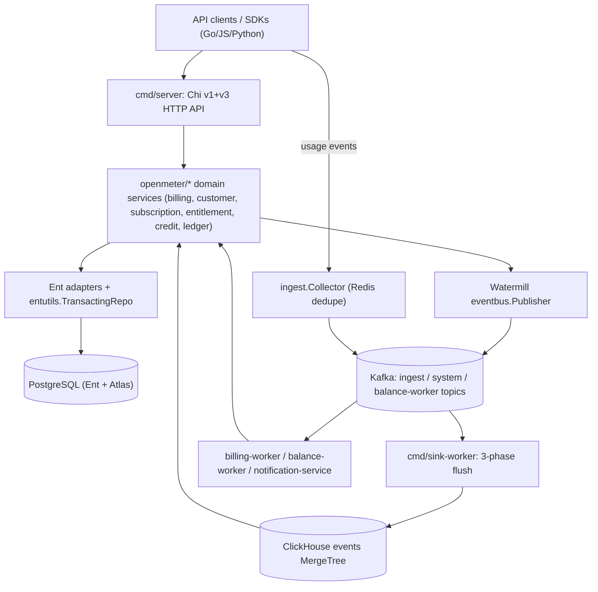

# AGENTS.md

> Architecture guidance for **Unknown Repository**
> Style: Multi-binary Go modulith: a single Go module whose business logic lives entirely in ~35 domain packages under openmeter/, each following a strict layered split (Service/Adapter interfaces defined at the package root, concrete logic in service/, Ent/PostgreSQL persistence in adapter/, HTTP translation in httpdriver/ or httphandler/ for v1 and api/v3/handlers/<resource>/ for v3). Six runnable Go binaries under cmd/ (server, billing-worker, balance-worker, sink-worker, notification-service, jobs) plus a separate benthos-collector Go module each compose a different subset of the domain tree through Google Wire provider sets concentrated in app/common/. The binaries never call each other in-process or over HTTP; cross-binary communication is exclusively asynchronous through three name-prefix-routed Kafka topics behind a Watermill eventbus facade. Cross-domain coupling is inverted via ServiceHook and RequestValidator registries registered as Wire-provider side-effects in app/common to keep domain packages import-cycle-free leaves. The v1+v3 HTTP API and Go/JS/Python SDKs are generated from a single TypeSpec source. Persistence is one PostgreSQL database (Ent + Atlas migrations) plus a single shared append-only ClickHouse MergeTree events table and optional Redis dedupe.
> Generated: 2026-06-04T08:36:31.802341+00:00

## Overview

OpenMeter is a multi-tenant usage-metering and billing platform that ingests CloudEvents usage data, aggregates it in ClickHouse, and drives entitlements, credit grants, a double-entry ledger, and invoice/charge billing through a versioned v1+v3 REST API. It is built as a single-Go-module modulith: ~35 layered domain packages under openmeter/ (each splitting Service/Adapter interfaces, Ent/PostgreSQL persistence, and HTTP drivers) composed by Google Wire into six runnable binaries (server, sink-worker, billing-worker, balance-worker, notification-service, jobs) plus a separate Benthos collector module. Binaries never call each other in-process; all cross-binary communication is asynchronous over three name-prefix-routed Kafka topics behind a Watermill eventbus facade, and cross-domain coupling is inverted through ServiceHook/RequestValidator registries wired as app/common provider side-effects. Persistence is one PostgreSQL database managed by Ent schemas plus Atlas migrations, a single shared append-only ClickHouse MergeTree events table written by the sink worker's strict three-phase flush, and optional Redis ingest deduplication. The entire v1+v3 API surface and the Go, JavaScript, and Python SDKs are generated from a single TypeSpec source, with billing using tagged-union charge/invoice-line models and stateless-backed state machines.

## Architecture

**Style:** All business logic lives in ~35 layered domain packages under openmeter/ (Service/Adapter interfaces at the package root, concrete logic in service/, Ent persistence in adapter/, HTTP translation in httpdriver/httphandler for v1 and api/v3/handlers/<resource>/ for v3). Six runnable binaries under cmd/ (server, billing-worker, balance-worker, sink-worker, notification-service, jobs) plus a separate benthos-collector Go module each compose a different subset of the domain tree through Google Wire provider sets concentrated in app/common/. Binaries never call each other in-process or over HTTP; cross-binary communication is exclusively asynchronous through three name-prefix-routed Kafka topics behind the Watermill eventbus facade. Cross-domain coupling is inverted via ServiceHook and RequestValidator registries registered as Wire-provider side-effects in app/common, keeping domain packages import-cycle-free leaves. The v1+v3 HTTP API and Go/JS/Python SDKs are generated from a single TypeSpec source. Persistence is one PostgreSQL database (Ent + Atlas migrations) plus a single shared append-only ClickHouse MergeTree events table and optional Redis dedupe.
**Structure:** modular

The product is a high-volume per-tenant usage-metering platform feeding strict financial billing, with three SDK languages and two API versions to keep in sync, run by a small team that cannot maintain separate repos or hand-synchronized contracts. Ingest throughput (openmeter/sink, openmeter/ingest), balance recalculation (openmeter/entitlement/balanceworker), billing advancement (openmeter/billing/worker), and webhook dispatch (openmeter/notification/consumer) have incompatible scaling and failure profiles, which forces process separation — but billing correctness demands one typed domain model, so the openmeter/ types are shared and only the cmd/ entrypoints differ. Google Wire (app/common/openmeter_<binary>.go composite sets) gives compile-time graph verification for the ~40 services each binary wires. The three prefix-routed Kafka topics in openmeter/watermill/eventbus/eventbus.go provide topic isolation so ingest bursts cannot starve billing consumers. TypeSpec (api/spec/) as the single API source makes drift between api/api.gen.go, api/v3/api.gen.go and the three SDKs structurally impossible.

**Root constraint:** Operate a high-volume per-tenant usage-metering platform feeding strict financial billing correctness, while shipping stable SDKs in three languages — under a small team that cannot maintain separate repos or hand-synchronized contracts.
- → Multi-binary Go modulith: one shared domain tree, six Wire-composed binaries, Kafka-only inter-binary coupling, single TypeSpec API source
- → TypeSpec as the single source of truth for both v1 and v3 HTTP APIs and all three SDKs
- → Ent ORM + Atlas migrations with context-propagated transactions (entutils.TransactingRepo) and per-customer pg locks

**Key trade-offs:**
- Ent-generated query friction: a large generated openmeter/ent/db/ tree, slower compile times, and the boilerplate Tx/WithTx/Self triad plus a TransactingRepo wrapper on every adapter method body. → Compile-time-checked relations across ~35 entities, automatic Atlas schema diffing into reviewable SQL, and ctx-propagated transactions with savepoint nesting for atomic multi-step charge/invoice flows.
- Multi-binary orchestration cost: six Docker image variants, Helm values complexity, and a separate Wire graph per binary that must each stay complete. → Independent horizontal scaling of sink-worker / balance-worker / billing-worker, fault isolation per binary, and isolated deploy cadence.
- Two-step regeneration cadence: TypeSpec changes require both make gen-api AND make generate, and five generators (oapi-codegen, Ent, Wire, Goverter, Goderive) write different artifacts that must all stay in sync. → Cross-language SDK contracts cannot drift — Go server stubs, Go SDK, JS SDK, Python SDK all originate from one TypeSpec source.

**Runs on:** self-hosted (Kubernetes via Helm); container images on GHCR
**Compute:** Kubernetes Deployments/StatefulSets via Helm chart (deploy/charts/openmeter), Depot remote build runners (depot-ubuntu-latest-*) for CI/CD, Six runtime binaries: server, sink-worker, balance-worker, billing-worker, notification-service, jobs, benthos-collector StatefulSet (deploy/charts/benthos-collector)
**CI/CD:** GitHub Actions (.github/workflows/): ci.yaml, artifacts.yaml, untrusted-artifacts.yaml, release.yaml, npm-release.yaml, sdk-python-dev-release.yaml, pr-checks.yaml, security.yaml, codeql.yml, codeql-go.yaml, analysis-scorecard.yaml, require-all-reviewers.yml, workflow-result.yaml, Depot build-push-action for multi-arch (linux/amd64+arm64) container images, Nix .#ci shell (nix develop --impure .#ci -c) pins all CI toolchain versions

## Data Models

OpenMeter persists all domain state (billing invoices/lines, charges, customers, subscriptions, entitlements, credit grants, double-entry ledger, meters, features, notifications, LLM cost prices) in one PostgreSQL database via ~35 hand-written Ent schema structs in openmeter/ent/schema that Atlas diffs into golang-migrate SQL files under tools/migrate/migrations; raw usage CloudEvents live append-only in a single shared ClickHouse MergeTree events table created by the connector at startup (openmeter/streaming/clickhouse/event_query.go), Redis provides TTL+SET-NX ingest deduplication (openmeter/dedupe), and Kafka (Watermill) is the cross-binary event bus. Every domain has a Service/Adapter pair and all writes go through entutils.TransactingRepo for ctx-bound transactions.

**Models** (full lifecycle in [`.claude/rules/data-models.md`](.claude/rules/data-models.md)):
- `BillingInvoice` (table) — `openmeter/ent/schema/billing.go`
- `Entitlement` (table) — `openmeter/ent/schema/entitlement.go`
- `BillingInvoiceLine` (table) — `openmeter/ent/schema/billing.go`
- `Grant` (table) — `openmeter/ent/schema/grant.go`
- `RawEvent` (entity) — `openmeter/streaming/connector.go`
- `Subscription` (table) — `openmeter/ent/schema/subscription.go`
- `Meter` (table) — `openmeter/ent/schema/meter.go`
- `NotificationEvent` (table) — `openmeter/ent/schema/notification.go`
- _… 14 more in [`.claude/rules/data-models.md`](.claude/rules/data-models.md)_

**Stores:**
- `primary_postgres` (PostgreSQL (atlas.hcl dev db docker://postgres/15; docker-compose base uses 14.20-alpine), role: primary) — owns: BillingInvoice, BillingInvoiceLine, Charge, Customer, CustomerSubjects, Subscription, SubscriptionItem, Entitlement, Grant, BalanceSnapshot, LedgerEntry, LedgerTransaction, LedgerAccount, LedgerSubAccountRoute, LedgerCustomerAccount, Meter, Feature, NotificationChannel, NotificationEvent, LLMCostPrice
- `redis_dedupe` (Redis (go-redis/v9), role: cache) — owns: dedupe.Item
- `clickhouse_events` (ClickHouse (clickhouse-go/v2), role: analytics) — owns: RawEvent
- `kafka_topics` (Kafka (confluent-kafka-go v2 + Watermill), role: queue)

## Architecture Diagram



## Commands

```bash
# up
docker compose up -d
# fmt
golangci-lint run --fix
# test
make test => PGPASSWORD=postgres psql healthcheck then POSTGRES_HOST=127.0.0.1 go test -p 128 -parallel 16 -tags=dynamic ./...
# lint
make lint => lint-go lint-api-spec lint-openapi lint-helm
# build
make build (builds server, sink-worker, benthos-collector, balance-worker, billing-worker, notification-service, jobs with -tags=dynamic)
# server
air -c ./cmd/server/.air.toml (make server)
# lint-go
golangci-lint run -v ./...
# test-all
docker compose up -d postgres svix redis; SVIX_HOST=localhost SVIX_JWT_SECRET=DUMMY_JWT_SECRET go test -p 128 -parallel 16 -tags=dynamic -count=1 ./...
```

_Full catalog (41 commands) in [`.claude/rules/technology.md`](.claude/rules/technology.md)._

## Architectural Rules

Detailed rules live as topic files under `.claude/rules/`. Read the relevant one when the task touches that surface:

- [`.claude/rules/architecture.md`](.claude/rules/architecture.md) — Components, file placement, naming conventions
- [`.claude/rules/patterns.md`](.claude/rules/patterns.md) — Communication patterns, integrations, key decisions, trade-offs (with violation signals)
- [`.claude/rules/technology.md`](.claude/rules/technology.md) — Tech stack, project structure, code templates, testing tooling
- [`.claude/rules/data-models.md`](.claude/rules/data-models.md) — Persistence stores, data models, per-model lifecycle (how to add/modify/read, backups, tests)
- [`.claude/rules/guidelines.md`](.claude/rules/guidelines.md) — Implementation guidelines for existing capabilities
- [`.claude/rules/pitfalls.md`](.claude/rules/pitfalls.md) — Documented traps with evidence + fix direction
- [`.claude/rules/dev-rules.md`](.claude/rules/dev-rules.md) — Coding-time imperatives (patterns, anti-patterns, boundaries, wiring)
- [`.claude/rules/infrastructure.md`](.claude/rules/infrastructure.md) — CI / signing / distribution / secrets / env setup / registry auth
- [`.claude/rules/enforcement/index.md`](.claude/rules/enforcement/index.md) — Every rule the pre-edit hook + plan/commit classifier consults, grouped by severity
- [`.claude/rules/frontend.md`](.claude/rules/frontend.md) — UI architecture, state, routing (when applicable)

## Enforcement Rules

[`.claude/rules/enforcement/index.md`](.claude/rules/enforcement/index.md) indexes every rule, grouped by topic and by path glob. Load only the topic file(s) relevant to the file you're editing — universal anti-patterns sit in `enforcement/universal.md`. The pre-edit hook (`PRE_VALIDATE_HOOK`) and plan/commit classifier (`align_check.py`) read [`.archie/rules.json`](.archie/rules.json) directly; the markdown is for agent/human browsing only.

## Per-folder Context

Every meaningful folder has its own `CLAUDE.md` (Archie's intent layer). Claude Code auto-loads the nearest one, so when editing a file under `some/component/`, look there first for the local invariants, anti-patterns, and adjacent code that uses the same shape.

---
*Auto-generated from structured architecture analysis. Place in project root.*

<!-- archie:generated:start -->
<!-- Regenerated by Archie on 2026-06-04T08:42Z. Edits between the archie:generated markers will be overwritten; edit outside them to keep changes. -->

# AGENTS.md

> Architecture guidance for **Unknown Repository**
> Style: Multi-binary Go modulith: a single Go module whose business logic lives entirely in ~35 domain packages under openmeter/, each following a strict layered split (Service/Adapter interfaces defined at the package root, concrete logic in service/, Ent/PostgreSQL persistence in adapter/, HTTP translation in httpdriver/ or httphandler/ for v1 and api/v3/handlers/<resource>/ for v3). Six runnable Go binaries under cmd/ (server, billing-worker, balance-worker, sink-worker, notification-service, jobs) plus a separate benthos-collector Go module each compose a different subset of the domain tree through Google Wire provider sets concentrated in app/common/. The binaries never call each other in-process or over HTTP; cross-binary communication is exclusively asynchronous through three name-prefix-routed Kafka topics behind a Watermill eventbus facade. Cross-domain coupling is inverted via ServiceHook and RequestValidator registries registered as Wire-provider side-effects in app/common to keep domain packages import-cycle-free leaves. The v1+v3 HTTP API and Go/JS/Python SDKs are generated from a single TypeSpec source. Persistence is one PostgreSQL database (Ent + Atlas migrations) plus a single shared append-only ClickHouse MergeTree events table and optional Redis dedupe.
> Generated: 2026-06-04T08:42:39.226146+00:00

## Overview

OpenMeter is a multi-tenant usage-metering and billing platform that ingests CloudEvents usage data, aggregates it in ClickHouse, and drives entitlements, credit grants, a double-entry ledger, and invoice/charge billing through a versioned v1+v3 REST API. It is built as a single-Go-module modulith: ~35 layered domain packages under openmeter/ (each splitting Service/Adapter interfaces, Ent/PostgreSQL persistence, and HTTP drivers) composed by Google Wire into six runnable binaries (server, sink-worker, billing-worker, balance-worker, notification-service, jobs) plus a separate Benthos collector module. Binaries never call each other in-process; all cross-binary communication is asynchronous over three name-prefix-routed Kafka topics behind a Watermill eventbus facade, and cross-domain coupling is inverted through ServiceHook/RequestValidator registries wired as app/common provider side-effects. Persistence is one PostgreSQL database managed by Ent schemas plus Atlas migrations, a single shared append-only ClickHouse MergeTree events table written by the sink worker's strict three-phase flush, and optional Redis ingest deduplication. The entire v1+v3 API surface and the Go, JavaScript, and Python SDKs are generated from a single TypeSpec source, with billing using tagged-union charge/invoice-line models and stateless-backed state machines.

## Architecture

**Style:** All business logic lives in ~35 layered domain packages under openmeter/ (Service/Adapter interfaces at the package root, concrete logic in service/, Ent persistence in adapter/, HTTP translation in httpdriver/httphandler for v1 and api/v3/handlers/<resource>/ for v3). Six runnable binaries under cmd/ (server, billing-worker, balance-worker, sink-worker, notification-service, jobs) plus a separate benthos-collector Go module each compose a different subset of the domain tree through Google Wire provider sets concentrated in app/common/. Binaries never call each other in-process or over HTTP; cross-binary communication is exclusively asynchronous through three name-prefix-routed Kafka topics behind the Watermill eventbus facade. Cross-domain coupling is inverted via ServiceHook and RequestValidator registries registered as Wire-provider side-effects in app/common, keeping domain packages import-cycle-free leaves. The v1+v3 HTTP API and Go/JS/Python SDKs are generated from a single TypeSpec source. Persistence is one PostgreSQL database (Ent + Atlas migrations) plus a single shared append-only ClickHouse MergeTree events table and optional Redis dedupe.
**Structure:** modular

The product is a high-volume per-tenant usage-metering platform feeding strict financial billing, with three SDK languages and two API versions to keep in sync, run by a small team that cannot maintain separate repos or hand-synchronized contracts. Ingest throughput (openmeter/sink, openmeter/ingest), balance recalculation (openmeter/entitlement/balanceworker), billing advancement (openmeter/billing/worker), and webhook dispatch (openmeter/notification/consumer) have incompatible scaling and failure profiles, which forces process separation — but billing correctness demands one typed domain model, so the openmeter/ types are shared and only the cmd/ entrypoints differ. Google Wire (app/common/openmeter_<binary>.go composite sets) gives compile-time graph verification for the ~40 services each binary wires. The three prefix-routed Kafka topics in openmeter/watermill/eventbus/eventbus.go provide topic isolation so ingest bursts cannot starve billing consumers. TypeSpec (api/spec/) as the single API source makes drift between api/api.gen.go, api/v3/api.gen.go and the three SDKs structurally impossible.

**Root constraint:** Operate a high-volume per-tenant usage-metering platform feeding strict financial billing correctness, while shipping stable SDKs in three languages — under a small team that cannot maintain separate repos or hand-synchronized contracts.
- → Multi-binary Go modulith: one shared domain tree, six Wire-composed binaries, Kafka-only inter-binary coupling, single TypeSpec API source
- → TypeSpec as the single source of truth for both v1 and v3 HTTP APIs and all three SDKs
- → Ent ORM + Atlas migrations with context-propagated transactions (entutils.TransactingRepo) and per-customer pg locks

**Key trade-offs:**
- Ent-generated query friction: a large generated openmeter/ent/db/ tree, slower compile times, and the boilerplate Tx/WithTx/Self triad plus a TransactingRepo wrapper on every adapter method body. → Compile-time-checked relations across ~35 entities, automatic Atlas schema diffing into reviewable SQL, and ctx-propagated transactions with savepoint nesting for atomic multi-step charge/invoice flows.
- Multi-binary orchestration cost: six Docker image variants, Helm values complexity, and a separate Wire graph per binary that must each stay complete. → Independent horizontal scaling of sink-worker / balance-worker / billing-worker, fault isolation per binary, and isolated deploy cadence.
- Two-step regeneration cadence: TypeSpec changes require both make gen-api AND make generate, and five generators (oapi-codegen, Ent, Wire, Goverter, Goderive) write different artifacts that must all stay in sync. → Cross-language SDK contracts cannot drift — Go server stubs, Go SDK, JS SDK, Python SDK all originate from one TypeSpec source.
- Cross-domain wiring and event routing are invisible to the compiler: hook/validator registration and credits guards are side-effects scattered across app/common, and Kafka topic routing depends on event-name string prefixes that default to SystemEventsTopic. → Domain packages stay import-cycle-free leaves; optional features are gated without nil-checks in business logic; the three-topic topology is hidden from producers.
- Sequential timestamped Atlas migration filenames plus a linear atlas.sum hash chain that, by construction, produces merge conflicts between any two branches that both append migrations. → Deterministic, reviewable, linearly-ordered SQL migration history with cryptographic chain integrity verified by CI (make migrate-check).
- Exactly-once ingestion depends on a hand-ordered three-phase flush and an upstream Redis dedupe rather than engine-level deduplication, so any reordering or skipped dedupe phase silently drops or double-counts events. → An append-only ClickHouse MergeTree hot path (no ReplacingMergeTree merge cost) with exactly-once delivery preserved across consumer restarts and a non-blocking post-flush notification path.
- FK-less cross-aggregate links (LedgerCustomerAccount.account_id/customer_id, LedgerSubAccountRoute denormalized routing columns, ClickHouse RawEvent struct vs DDL) push referential integrity and column/struct alignment onto application code with no database-level guard. → Import-cycle-free ledger package, join-free routing resolution on the posting hot path, and a migration-less create-if-not-exists ClickHouse table that needs no Atlas pipeline.

**Runs on:** self-hosted (Kubernetes via Helm); container images on GHCR
**Compute:** Kubernetes Deployments/StatefulSets via Helm chart (deploy/charts/openmeter), Depot remote build runners (depot-ubuntu-latest-*) for CI/CD, Six runtime binaries: server, sink-worker, balance-worker, billing-worker, notification-service, jobs, benthos-collector StatefulSet (deploy/charts/benthos-collector)
**CI/CD:** GitHub Actions (.github/workflows/): ci.yaml, artifacts.yaml, untrusted-artifacts.yaml, release.yaml, npm-release.yaml, sdk-python-dev-release.yaml, pr-checks.yaml, security.yaml, codeql.yml, codeql-go.yaml, analysis-scorecard.yaml, require-all-reviewers.yml, workflow-result.yaml, Depot build-push-action for multi-arch (linux/amd64+arm64) container images, Nix .#ci shell (nix develop --impure .#ci -c) pins all CI toolchain versions

## Data Models

OpenMeter persists all domain state (billing invoices/lines, charges, customers, subscriptions, entitlements, credit grants, double-entry ledger, meters, features, notifications, LLM cost prices) in one PostgreSQL database via ~35 hand-written Ent schema structs in openmeter/ent/schema that Atlas diffs into golang-migrate SQL files under tools/migrate/migrations; raw usage CloudEvents live append-only in a single shared ClickHouse MergeTree events table created by the connector at startup (openmeter/streaming/clickhouse/event_query.go), Redis provides TTL+SET-NX ingest deduplication (openmeter/dedupe), and Kafka (Watermill) is the cross-binary event bus. Every domain has a Service/Adapter pair and all writes go through entutils.TransactingRepo for ctx-bound transactions.

**Models** (full lifecycle in [`.claude/rules/data-models.md`](.claude/rules/data-models.md)):
- `BillingInvoice` (table) — `openmeter/ent/schema/billing.go`
- `Entitlement` (table) — `openmeter/ent/schema/entitlement.go`
- `BillingInvoiceLine` (table) — `openmeter/ent/schema/billing.go`
- `Grant` (table) — `openmeter/ent/schema/grant.go`
- `RawEvent` (entity) — `openmeter/streaming/connector.go`
- `Subscription` (table) — `openmeter/ent/schema/subscription.go`
- `Meter` (table) — `openmeter/ent/schema/meter.go`
- `NotificationEvent` (table) — `openmeter/ent/schema/notification.go`
- `Customer` (table) — `openmeter/ent/schema/customer.go`
- `dedupe.Item` (key_value) — `openmeter/dedupe/dedupe.go`
- `Feature` (table) — `openmeter/ent/schema/feature.go`
- `SubscriptionItem` (table) — `openmeter/ent/schema/subscription.go`
- `LLMCostPrice` (table) — `openmeter/ent/schema/llmcostprice.go`
- `LedgerSubAccountRoute` (table) — `openmeter/ent/schema/ledger_account.go`
- `Charge` (table) — `openmeter/ent/schema/charges.go`
- `BalanceSnapshot` (table) — `openmeter/ent/schema/balance_snapshot.go`
- `CustomerSubjects` (table) — `openmeter/ent/schema/customer.go`
- `LedgerEntry` (table) — `openmeter/ent/schema/ledger_entry.go`
- `NotificationChannel` (table) — `openmeter/ent/schema/notification.go`
- `LedgerCustomerAccount` (table) — `openmeter/ent/schema/ledger_customer_account.go`
- `LedgerTransaction` (table) — `openmeter/ent/schema/ledger_transaction.go`
- `LedgerAccount` (table) — `openmeter/ent/schema/ledger_account.go`
- _… 14 more in [`.claude/rules/data-models.md`](.claude/rules/data-models.md)_

**Stores:**
- `primary_postgres` (PostgreSQL (atlas.hcl dev db docker://postgres/15; docker-compose base uses 14.20-alpine), role: primary) — owns: BillingInvoice, BillingInvoiceLine, Charge, Customer, CustomerSubjects, Subscription, SubscriptionItem, Entitlement, Grant, BalanceSnapshot, LedgerEntry, LedgerTransaction, LedgerAccount, LedgerSubAccountRoute, LedgerCustomerAccount, Meter, Feature, NotificationChannel, NotificationEvent, LLMCostPrice
- `redis_dedupe` (Redis (go-redis/v9), role: cache) — owns: dedupe.Item
- `clickhouse_events` (ClickHouse (clickhouse-go/v2), role: analytics) — owns: RawEvent
- `kafka_topics` (Kafka (confluent-kafka-go v2 + Watermill), role: queue)

## Architecture Diagram


## Commands

```bash
# up
docker compose up -d
# fmt
golangci-lint run --fix
# test
make test => PGPASSWORD=postgres psql healthcheck then POSTGRES_HOST=127.0.0.1 go test -p 128 -parallel 16 -tags=dynamic ./...
# lint
make lint => lint-go lint-api-spec lint-openapi lint-helm
# build
make build (builds server, sink-worker, benthos-collector, balance-worker, billing-worker, notification-service, jobs with -tags=dynamic)
# server
air -c ./cmd/server/.air.toml (make server)
# lint-go
golangci-lint run -v ./...
# test-all
docker compose up -d postgres svix redis; SVIX_HOST=localhost SVIX_JWT_SECRET=DUMMY_JWT_SECRET go test -p 128 -parallel 16 -tags=dynamic -count=1 ./...
```

_Full catalog (41 commands) in [`.claude/rules/technology.md`](.claude/rules/technology.md)._

## Architectural Rules

Detailed rules live as topic files under `.claude/rules/`. Read the relevant one when the task touches that surface:

- [`.claude/rules/architecture.md`](.claude/rules/architecture.md) — Components, file placement, naming conventions
- [`.claude/rules/patterns.md`](.claude/rules/patterns.md) — Communication patterns, integrations, key decisions, trade-offs (with violation signals)
- [`.claude/rules/technology.md`](.claude/rules/technology.md) — Tech stack, project structure, code templates, testing tooling
- [`.claude/rules/data-models.md`](.claude/rules/data-models.md) — Persistence stores, data models, per-model lifecycle (how to add/modify/read, backups, tests)
- [`.claude/rules/guidelines.md`](.claude/rules/guidelines.md) — Implementation guidelines for existing capabilities
- [`.claude/rules/pitfalls.md`](.claude/rules/pitfalls.md) — Documented traps with evidence + fix direction
- [`.claude/rules/dev-rules.md`](.claude/rules/dev-rules.md) — Coding-time imperatives (patterns, anti-patterns, boundaries, wiring)
- [`.claude/rules/infrastructure.md`](.claude/rules/infrastructure.md) — CI / signing / distribution / secrets / env setup / registry auth
- [`.claude/rules/enforcement/index.md`](.claude/rules/enforcement/index.md) — Every rule the pre-edit hook + plan/commit classifier consults, grouped by severity
- [`.claude/rules/frontend.md`](.claude/rules/frontend.md) — UI architecture, state, routing (when applicable)

## Enforcement Rules

[`.claude/rules/enforcement/index.md`](.claude/rules/enforcement/index.md) indexes every rule, grouped by topic and by path glob. Load only the topic file(s) relevant to the file you're editing — universal anti-patterns sit in `enforcement/universal.md`. The pre-edit hook (`PRE_VALIDATE_HOOK`) and plan/commit classifier (`align_check.py`) read [`.archie/rules.json`](.archie/rules.json) directly; the markdown is for agent/human browsing only.

## Per-folder Context

Every meaningful folder has its own `CLAUDE.md` (Archie's intent layer). Claude Code auto-loads the nearest one, so when editing a file under `some/component/`, look there first for the local invariants, anti-patterns, and adjacent code that uses the same shape.

---
*Auto-generated from structured architecture analysis. Place in project root.*
<!-- archie:generated:end -->
