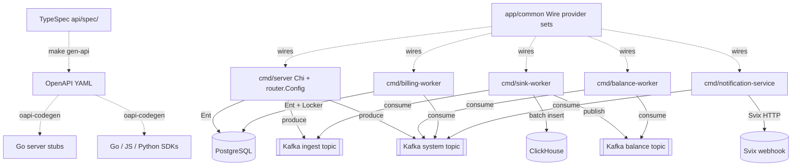

# AGENTS.md

> Architecture guidance for **Unknown Repository**
> Style: Single Go monorepo producing seven independently deployable binaries (cmd/server, cmd/billing-worker, cmd/balance-worker, cmd/sink-worker, cmd/notification-service, cmd/jobs, cmd/benthos-collector). All binaries share domain packages under openmeter/ assembled via Google Wire DI in app/common. The HTTP surface is authored in TypeSpec (api/spec/) compiled to OpenAPI YAML and then to Go stubs; v1 is served by openmeter/server/router using Chi + kin-openapi and v3 is served by api/v3/server using Chi + oasmiddleware. PostgreSQL via Ent ORM is the system of record with Atlas-managed migrations; ClickHouse stores usage events for meter aggregations; Kafka via Watermill is the async event bus with three named topics routed by event-name prefix. Domain packages follow a strict service-interface / adapter-implementation / httpdriver-transport layering with cross-domain callbacks mediated by ServiceHooks and RequestValidator registries to avoid circular imports.
> Generated: 2026-05-04T09:59:36.865084+00:00

## Overview

OpenMeter is a Go monorepo metering and billing platform that compiles seven distinct binaries from a single codebase. Every binary shares domain packages under openmeter/ whose internal structure follows a consistent three-layer pattern: a service interface at the domain root, a concrete service implementation in a service/ sub-package, and a PostgreSQL-backed adapter implementation in an adapter/ sub-package. HTTP handlers live in httpdriver/ or httphandler/ sub-packages and use a generic httptransport.Handler[Request,Response] pipeline from pkg/framework. The API contract is authored in TypeSpec (api/spec/), compiled to OpenAPI YAML, and further compiled by oapi-codegen to Go server stubs; the generated stubs are never hand-edited. Kafka is the sole inter-binary communication channel, with three fixed topics (ingest, system, balance-worker) routed by event-name prefix inside openmeter/watermill/eventbus, and Watermill providing structured router middleware and typed CloudEvents dispatch.

## Architecture

**Style:** Single Go monorepo producing seven deployable binaries (cmd/server, cmd/billing-worker, cmd/balance-worker, cmd/sink-worker, cmd/notification-service, cmd/jobs, cmd/benthos-collector). All binaries share domain packages under openmeter/ with strict service/adapter/httpdriver layering, are wired via Google Wire provider sets concentrated in app/common, expose a contract-first HTTP API authored in TypeSpec under api/spec/ that compiles to dual API versions (v1 via api/api.gen.go + openmeter/server/router, v3 via api/v3/api.gen.go + api/v3/handlers), persist to PostgreSQL via Ent ORM with Atlas-managed migrations, query usage from ClickHouse via streaming.Connector, and exchange domain events over Kafka via Watermill with three named topics (ingest, system, balance-worker) routed by event-name prefix in openmeter/watermill/eventbus.
**Structure:** modular

OpenMeter must support high-volume per-tenant usage metering feeding strict billing correctness with stable multi-language SDKs (Go/JS/Python). Ingest, balance recalculation, billing advancement, and notification dispatch have very different scaling profiles and failure modes, so they need to be independently deployable and scalable. At the same time billing correctness across charges, ledger, and invoices requires a single typed domain model. Multi-binary + shared domain packages preserves the single type system; Wire makes binary-specific provider graphs compile-time verified; TypeSpec-as-source eliminates SDK drift; Ent+Atlas keeps schema and Go types coupled; Kafka+Watermill decouples sink-worker from balance-worker from billing-worker.

**Key trade-offs:**
- Ent-generated query friction (large openmeter/ent/db/ tree, slower compile, boilerplate Tx/WithTx/Self triad on every adapter) → Compile-time-checked relations across ~60 entities, automatic Atlas diffing, no runtime schema surprises, ctx-propagated transactions with savepoint nesting
- Multi-binary orchestration cost (seven Docker image variants, Helm values complexity, separate Wire graphs per binary) → Independent horizontal scaling of sink-worker / balance-worker / billing-worker, fault isolation, isolated deploy cadence
- Two-step regen cadence (TypeSpec changes require `make gen-api` AND `make generate`; multiple generators write different artifacts) → Cross-language SDK contracts cannot drift: Go server stubs, Go SDK, JS SDK, Python SDK all originate from a single TypeSpec source

**Runs on:** self-hosted
**Compute:** cmd/server — Main HTTP API server (openmeter binary), cmd/sink-worker — Kafka->ClickHouse sink (openmeter-sink-worker binary), cmd/balance-worker — Entitlement balance recalculation (openmeter-balance-worker binary), cmd/billing-worker — Billing lifecycle worker (openmeter-billing-worker binary), cmd/notification-service — Webhook/notification dispatcher (openmeter-notification-service binary), cmd/jobs — Admin CLI for one-off jobs (openmeter-jobs binary), cmd/benthos-collector — Benthos event pipeline (benthos binary, separate image)
**CI/CD:** GitHub Actions (ci.yaml) — Build, lint (go/api-spec/openapi/helm), test on every push/PR using Nix .#ci shell on Depot runners, GitHub Actions (release.yaml) — Publishes Docker images to GHCR, Helm charts to GHCR OCI, npm @openmeter/sdk, Python SDK on version tags, GitHub Actions (artifacts.yaml) — Reusable workflow: builds and pushes multi-platform container images (linux/amd64, linux/arm64) via Depot, GitHub Actions (npm-release.yaml) — Reusable workflow: publishes @openmeter/sdk to npm via OIDC trusted publishing, GitHub Actions (pr-checks.yaml) — Enforces release-note label on every PR, GitHub Actions (security.yaml) — Trufflehog secret scanning + SCA (syft) + GitHub workflow scan; fail_on_findings=true, GitHub Actions (analysis-scorecard.yaml) — OpenSSF Scorecard analysis weekly (Fridays) and on main push, GitHub Actions (sdk-python-dev-release.yaml) — Python SDK beta release on main push and workflow_dispatch, GitHub Actions (require-all-reviewers.yml) — Enforces all requested reviewers approve when PR has require-all-reviewers label, GitHub Actions (workflow-result.yaml) — Reusable required-check pass/fail aggregator, GitHub Actions (untrusted-artifacts.yaml) — Builds container image without publishing for PR safety

## Architecture Diagram



## Commands

```bash
# up
docker compose up -d
# fmt
golangci-lint run --fix
# test
POSTGRES_HOST=127.0.0.1 go test -p 128 -parallel 16 -tags=dynamic ./...
# lint
make lint-go lint-api-spec lint-openapi lint-helm
# build
go build -o build/ -tags=dynamic ./cmd/...
# server
air -c ./cmd/server/.air.toml
# lint-go
golangci-lint run -v ./...
# test-all
docker compose up -d postgres svix redis && SVIX_HOST=localhost go test -p 128 -parallel 16 -tags=dynamic -count=1 ./...
```

_Full catalog (42 commands) in [`.claude/rules/technology.md`](.claude/rules/technology.md)._

## Architectural Rules

Detailed rules live as topic files under `.claude/rules/`. Read the relevant one when the task touches that surface:

- [`.claude/rules/architecture.md`](.claude/rules/architecture.md) — Components, file placement, naming conventions
- [`.claude/rules/patterns.md`](.claude/rules/patterns.md) — Communication patterns, integrations, key decisions, trade-offs (with violation signals)
- [`.claude/rules/technology.md`](.claude/rules/technology.md) — Tech stack, project structure, code templates, testing tooling
- [`.claude/rules/guidelines.md`](.claude/rules/guidelines.md) — Implementation guidelines for existing capabilities
- [`.claude/rules/pitfalls.md`](.claude/rules/pitfalls.md) — Documented traps with evidence + fix direction
- [`.claude/rules/dev-rules.md`](.claude/rules/dev-rules.md) — Coding-time imperatives (patterns, anti-patterns, boundaries, wiring)
- [`.claude/rules/infrastructure.md`](.claude/rules/infrastructure.md) — CI / signing / distribution / secrets / env setup / registry auth
- [`.claude/rules/enforcement.md`](.claude/rules/enforcement.md) — Every rule the pre-edit hook + plan/commit classifier consults, grouped by severity

## Enforcement Rules

[`.claude/rules/enforcement.md`](.claude/rules/enforcement.md) lists every rule the pre-edit hook (`PRE_VALIDATE_HOOK`) and plan/commit classifier (`align_check.py`) consult, grouped by severity. The underlying source on disk is [`.archie/rules.json`](.archie/rules.json) (project-specific) plus [`.archie/platform_rules.json`](.archie/platform_rules.json) (universal anti-patterns shipped with Archie).

## Per-folder Context

Every meaningful folder has its own `CLAUDE.md` (Archie's intent layer). Claude Code auto-loads the nearest one, so when editing a file under `some/component/`, look there first for the local invariants, anti-patterns, and adjacent code that uses the same shape.

---
*Auto-generated from structured architecture analysis. Place in project root.*

<!-- archie:generated:start -->
<!-- Regenerated by Archie on 2026-05-04T10:08Z. Edits between the archie:generated markers will be overwritten; edit outside them to keep changes. -->

# AGENTS.md

> Architecture guidance for **Unknown Repository**
> Style: Single Go monorepo producing seven independently deployable binaries (cmd/server, cmd/billing-worker, cmd/balance-worker, cmd/sink-worker, cmd/notification-service, cmd/jobs, cmd/benthos-collector). All binaries share domain packages under openmeter/ assembled via Google Wire DI in app/common. The HTTP surface is authored in TypeSpec (api/spec/) compiled to OpenAPI YAML and then to Go stubs; v1 is served by openmeter/server/router using Chi + kin-openapi and v3 is served by api/v3/server using Chi + oasmiddleware. PostgreSQL via Ent ORM is the system of record with Atlas-managed migrations; ClickHouse stores usage events for meter aggregations; Kafka via Watermill is the async event bus with three named topics routed by event-name prefix. Domain packages follow a strict service-interface / adapter-implementation / httpdriver-transport layering with cross-domain callbacks mediated by ServiceHooks and RequestValidator registries to avoid circular imports.
> Generated: 2026-05-04T10:08:16.715084+00:00

## Overview

OpenMeter is a Go monorepo metering and billing platform that compiles seven distinct binaries from a single codebase. Every binary shares domain packages under openmeter/ whose internal structure follows a consistent three-layer pattern: a service interface at the domain root, a concrete service implementation in a service/ sub-package, and a PostgreSQL-backed adapter implementation in an adapter/ sub-package. HTTP handlers live in httpdriver/ or httphandler/ sub-packages and use a generic httptransport.Handler[Request,Response] pipeline from pkg/framework. The API contract is authored in TypeSpec (api/spec/), compiled to OpenAPI YAML, and further compiled by oapi-codegen to Go server stubs; the generated stubs are never hand-edited. Kafka is the sole inter-binary communication channel, with three fixed topics (ingest, system, balance-worker) routed by event-name prefix inside openmeter/watermill/eventbus, and Watermill providing structured router middleware and typed CloudEvents dispatch.

## Architecture

**Style:** Single Go monorepo producing seven deployable binaries (cmd/server, cmd/billing-worker, cmd/balance-worker, cmd/sink-worker, cmd/notification-service, cmd/jobs, cmd/benthos-collector). All binaries share domain packages under openmeter/ with strict service/adapter/httpdriver layering, are wired via Google Wire provider sets concentrated in app/common, expose a contract-first HTTP API authored in TypeSpec under api/spec/ that compiles to dual API versions (v1 via api/api.gen.go + openmeter/server/router, v3 via api/v3/api.gen.go + api/v3/handlers), persist to PostgreSQL via Ent ORM with Atlas-managed migrations, query usage from ClickHouse via streaming.Connector, and exchange domain events over Kafka via Watermill with three named topics (ingest, system, balance-worker) routed by event-name prefix in openmeter/watermill/eventbus.
**Structure:** modular

OpenMeter must support high-volume per-tenant usage metering feeding strict billing correctness with stable multi-language SDKs (Go/JS/Python). Ingest, balance recalculation, billing advancement, and notification dispatch have very different scaling profiles and failure modes, so they need to be independently deployable and scalable. At the same time billing correctness across charges, ledger, and invoices requires a single typed domain model. Multi-binary + shared domain packages preserves the single type system; Wire makes binary-specific provider graphs compile-time verified; TypeSpec-as-source eliminates SDK drift; Ent+Atlas keeps schema and Go types coupled; Kafka+Watermill decouples sink-worker from balance-worker from billing-worker.

**Key trade-offs:**
- Ent-generated query friction (large openmeter/ent/db/ tree, slower compile, boilerplate Tx/WithTx/Self triad on every adapter) → Compile-time-checked relations across ~60 entities, automatic Atlas diffing, no runtime schema surprises, ctx-propagated transactions with savepoint nesting
- Multi-binary orchestration cost (seven Docker image variants, Helm values complexity, separate Wire graphs per binary) → Independent horizontal scaling of sink-worker / balance-worker / billing-worker, fault isolation, isolated deploy cadence
- Two-step regen cadence (TypeSpec changes require `make gen-api` AND `make generate`; multiple generators write different artifacts) → Cross-language SDK contracts cannot drift: Go server stubs, Go SDK, JS SDK, Python SDK all originate from a single TypeSpec source

**Runs on:** self-hosted
**Compute:** cmd/server — Main HTTP API server (openmeter binary), cmd/sink-worker — Kafka->ClickHouse sink (openmeter-sink-worker binary), cmd/balance-worker — Entitlement balance recalculation (openmeter-balance-worker binary), cmd/billing-worker — Billing lifecycle worker (openmeter-billing-worker binary), cmd/notification-service — Webhook/notification dispatcher (openmeter-notification-service binary), cmd/jobs — Admin CLI for one-off jobs (openmeter-jobs binary), cmd/benthos-collector — Benthos event pipeline (benthos binary, separate image)
**CI/CD:** GitHub Actions (ci.yaml) — Build, lint (go/api-spec/openapi/helm), test on every push/PR using Nix .#ci shell on Depot runners, GitHub Actions (release.yaml) — Publishes Docker images to GHCR, Helm charts to GHCR OCI, npm @openmeter/sdk, Python SDK on version tags, GitHub Actions (artifacts.yaml) — Reusable workflow: builds and pushes multi-platform container images (linux/amd64, linux/arm64) via Depot, GitHub Actions (npm-release.yaml) — Reusable workflow: publishes @openmeter/sdk to npm via OIDC trusted publishing, GitHub Actions (pr-checks.yaml) — Enforces release-note label on every PR, GitHub Actions (security.yaml) — Trufflehog secret scanning + SCA (syft) + GitHub workflow scan; fail_on_findings=true, GitHub Actions (analysis-scorecard.yaml) — OpenSSF Scorecard analysis weekly (Fridays) and on main push, GitHub Actions (sdk-python-dev-release.yaml) — Python SDK beta release on main push and workflow_dispatch, GitHub Actions (require-all-reviewers.yml) — Enforces all requested reviewers approve when PR has require-all-reviewers label, GitHub Actions (workflow-result.yaml) — Reusable required-check pass/fail aggregator, GitHub Actions (untrusted-artifacts.yaml) — Builds container image without publishing for PR safety

## Architecture Diagram


## Commands

```bash
# up
docker compose up -d
# fmt
golangci-lint run --fix
# test
POSTGRES_HOST=127.0.0.1 go test -p 128 -parallel 16 -tags=dynamic ./...
# lint
make lint-go lint-api-spec lint-openapi lint-helm
# build
go build -o build/ -tags=dynamic ./cmd/...
# server
air -c ./cmd/server/.air.toml
# lint-go
golangci-lint run -v ./...
# test-all
docker compose up -d postgres svix redis && SVIX_HOST=localhost go test -p 128 -parallel 16 -tags=dynamic -count=1 ./...
```

_Full catalog (42 commands) in [`.claude/rules/technology.md`](.claude/rules/technology.md)._

## Architectural Rules

Detailed rules live as topic files under `.claude/rules/`. Read the relevant one when the task touches that surface:

- [`.claude/rules/architecture.md`](.claude/rules/architecture.md) — Components, file placement, naming conventions
- [`.claude/rules/patterns.md`](.claude/rules/patterns.md) — Communication patterns, integrations, key decisions, trade-offs (with violation signals)
- [`.claude/rules/technology.md`](.claude/rules/technology.md) — Tech stack, project structure, code templates, testing tooling
- [`.claude/rules/guidelines.md`](.claude/rules/guidelines.md) — Implementation guidelines for existing capabilities
- [`.claude/rules/pitfalls.md`](.claude/rules/pitfalls.md) — Documented traps with evidence + fix direction
- [`.claude/rules/dev-rules.md`](.claude/rules/dev-rules.md) — Coding-time imperatives (patterns, anti-patterns, boundaries, wiring)
- [`.claude/rules/infrastructure.md`](.claude/rules/infrastructure.md) — CI / signing / distribution / secrets / env setup / registry auth
- [`.claude/rules/enforcement.md`](.claude/rules/enforcement.md) — Every rule the pre-edit hook + plan/commit classifier consults, grouped by severity

## Enforcement Rules

[`.claude/rules/enforcement.md`](.claude/rules/enforcement.md) lists every rule the pre-edit hook (`PRE_VALIDATE_HOOK`) and plan/commit classifier (`align_check.py`) consult, grouped by severity. The underlying source on disk is [`.archie/rules.json`](.archie/rules.json) (project-specific) plus [`.archie/platform_rules.json`](.archie/platform_rules.json) (universal anti-patterns shipped with Archie).

## Per-folder Context

Every meaningful folder has its own `CLAUDE.md` (Archie's intent layer). Claude Code auto-loads the nearest one, so when editing a file under `some/component/`, look there first for the local invariants, anti-patterns, and adjacent code that uses the same shape.

---
*Auto-generated from structured architecture analysis. Place in project root.*
<!-- archie:generated:end -->
