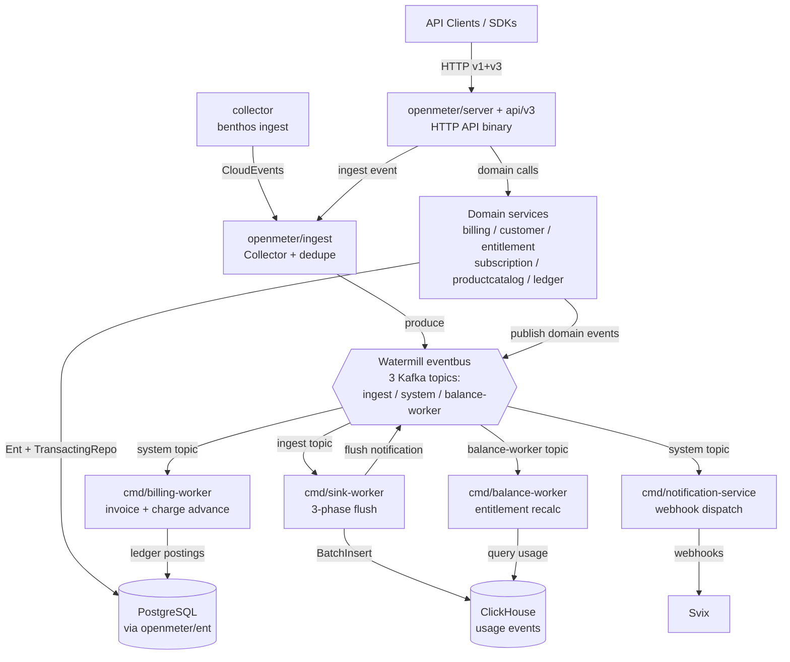

# AGENTS.md

> Architecture guidance for **Unknown Repository**
> Style: Multi-binary Go modulith: a single Go module with ~35 independent domain packages under openmeter/, each organized as a strict layered service/adapter/httpdriver split (Service interface + Adapter interface defined at the package root, concrete service logic in service/, Ent/PostgreSQL persistence in adapter/, HTTP translation in httpdriver/ or httphandler/). Six runnable binaries (server + four workers + jobs CLI, plus a separate benthos-collector module) each compose ~40 domain services through Google Wire provider sets concentrated in app/common/. Cross-binary communication is exclusively asynchronous via three name-prefix-routed Kafka topics through a Watermill eventbus facade. Cross-domain coupling is inverted via ServiceHook and RequestValidator registries registered as Wire provider side-effects in app/common to keep domain packages import-cycle-free leaves. The HTTP API surface (v1 + v3) is generated from TypeSpec into Go server stubs and Go/JS/Python SDKs.
> Generated: 2026-06-02T19:33:42.296587+00:00

## Overview

OpenMeter is a multi-tenant usage-metering and billing platform that ingests CloudEvents, aggregates them into meters in ClickHouse, and drives entitlement balances and financial billing on top of that usage data. It is a single Go module organized as a layered service/adapter/httpdriver modulith of ~35 domain packages under openmeter/, compiled into six runnable binaries (HTTP API server, sink/balance/billing workers, notification-service, and a jobs CLI) composed via Google Wire provider sets in app/common. Synchronous request handling flows through a TypeSpec-generated v1+v3 HTTP API into domain services that persist to PostgreSQL via Ent and entutils.TransactingRepo, while all cross-binary communication is asynchronous over three prefix-routed Kafka topics through a Watermill eventbus facade. The usage path streams events from the benthos collector through the ingest Collector into Kafka, where the sink-worker performs a strict three-phase flush (ClickHouse insert, Kafka offset commit, Redis dedupe) and the balance-worker recalculates entitlement grant burn-down. Billing correctness is enforced through tagged-union domain models, stateless-library invoice/charge state machines, per-customer pg_advisory_xact_lock serialization, and a double-entry ledger, with Stripe and Svix as the primary external billing and webhook integrations.

## Architecture

**Style:** All business logic lives in a single shared package tree under openmeter/ (23 components: billing, customer, entitlement, subscription, ledger, credit, notification, meter+ingest+sink+streaming, etc.), each following a Service/Adapter/HTTP layering. Seven thin binaries under cmd/ (server, billing-worker, balance-worker, sink-worker, notification-service, jobs, benthos-collector) each compose a different subset of that tree via Google Wire provider sets concentrated in app/common/. The binaries never call each other in-process or over HTTP; they communicate exclusively through three name-prefix-routed Kafka topics via the openmeter/watermill eventbus. Persistence is one PostgreSQL database (Ent + Atlas) plus a shared append-only ClickHouse events table and optional Redis dedupe.
**Structure:** modular

Ingest throughput (openmeter/sink consuming raw CloudEvents via confluent-kafka-go), entitlement balance recalculation (openmeter/entitlement/balanceworker), billing advancement (openmeter/billing/worker), and webhook dispatch (openmeter/notification/consumer + Svix) have incompatible scaling and failure profiles, so they are split into separate binaries that scale independently. But billing correctness demands one typed domain model shared across them — hence a shared package tree, not separate services with duplicated types. The blueprint shows this directly: every cmd/<binary>/wire.go (cmd/billing-worker/wire.go) pulls composite provider sets from app/common, and domain packages expose plain constructors and never import app/common (the leaf-node import rule). Kafka topic isolation (openmeter/watermill/eventbus/eventbus.go GeneratePublishTopic routing ingest/system/balance-worker by EventName prefix) is what lets an ingest burst not starve billing system-event consumers.

**Root constraint:** Operate a high-volume per-tenant usage-metering platform feeding strict financial billing correctness, while shipping stable SDKs in three languages — under a small team that cannot maintain separate repos or hand-synchronized contracts.
- → Multi-binary modular monolith: one shared Go domain tree, seven independently deployable binaries, Kafka as the sole inter-binary channel
- → TypeSpec as the single source of truth for both v1 and v3 HTTP APIs and all three SDKs
- → Ent ORM + Atlas migrations with context-propagated transactions (entutils.TransactingRepo) and per-customer pg locks (lockr)

**Key trade-offs:**
- Ent-generated query friction: a large generated openmeter/ent/db/ tree, slower compile times, and the boilerplate Tx/WithTx/Self triad plus a TransactingRepo wrapper on every adapter method body. → Compile-time-checked relations across ~35 entities, automatic Atlas schema diffing into reviewable SQL, and ctx-propagated transactions with savepoint nesting for atomic multi-step charge/invoice flows.
- Multi-binary orchestration cost: seven Docker image variants, Helm values complexity, and a separate Wire graph per binary that must each stay complete. → Independent horizontal scaling of sink-worker / balance-worker / billing-worker, fault isolation per binary, and isolated deploy cadence.
- Two-step regeneration cadence: TypeSpec changes require both `make gen-api` AND `make generate`, and five generators (oapi-codegen, Ent, Wire, Goverter, Goderive) write different artifacts that must all stay in sync. → Cross-language SDK contracts cannot drift — Go server stubs, Go SDK, JS SDK, Python SDK all originate from one TypeSpec source.

**Runs on:** self-hosted
**Compute:** Docker containers (six OpenMeter binaries + separate benthos-collector image), Kubernetes via Helm charts (deploy/charts/openmeter, deploy/charts/benthos-collector)
**CI/CD:** GitHub Actions (.github/workflows/ci.yaml: build/test/lint/migrations/generators/e2e/quickstart on Depot runners via Nix .#ci shell), artifacts.yaml + untrusted-artifacts.yaml (Depot depot-build-push-action, multi-platform images), release.yaml (Helm + npm release), npm-release.yaml (OIDC trusted publishing), sdk-python-dev-release.yaml (Python alpha), codeql.yml + codeql-go.yaml, analysis-scorecard.yaml, security.yaml (Trufflehog), pr-checks.yaml, require-all-reviewers.yml, FOSSA scan

## Data Models

OpenMeter persists all domain state (billing invoices/lines, charges, customers, subscriptions, entitlements, credit grants, double-entry ledger, meters, features/plans, notifications, LLM cost prices) in a single PostgreSQL database via ~35 Ent schema structs that Atlas diffs into golang-migrate SQL files; raw usage events live append-only in a single shared ClickHouse MergeTree events table (queried by streaming.Connector), and Redis provides TTL-based ingest deduplication. Kafka (Watermill) is the cross-binary event bus. Every domain has a service/adapter pair; all writes go through entutils.TransactingRepo for ctx-bound transactions.

**Models** (full lifecycle in [`.claude/rules/data-models.md`](.claude/rules/data-models.md)):
- `BillingInvoice` (table) — `openmeter/ent/schema/billing.go`
- `BillingInvoiceLine` (table) — `openmeter/ent/schema/billing.go`
- `Entitlement` (table) — `openmeter/ent/schema/entitlement.go`
- `Grant` (table) — `openmeter/ent/schema/grant.go`
- `Subscription` (table) — `openmeter/ent/schema/subscription.go`
- `Meter` (table) — `openmeter/ent/schema/meter.go`
- `Customer` (table) — `openmeter/ent/schema/customer.go`
- `RawEvent` (entity) — `openmeter/streaming/connector.go`
- _… 9 more in [`.claude/rules/data-models.md`](.claude/rules/data-models.md)_

**Stores:**
- `primary_postgres` (PostgreSQL 14.20-alpine (dev compose; docs reference 15), role: primary) — owns: BillingInvoice, BillingInvoiceLine, Charge, Customer, Subscription, Entitlement, Grant, BalanceSnapshot, LedgerEntry, LedgerAccount, LedgerCustomerAccount, Meter, Feature, NotificationEvent, LLMCostPrice
- `redis_dedupe` (Redis 7.4.7, role: cache) — owns: dedupe.Item
- `clickhouse_events` (ClickHouse 25.12.3-alpine, role: analytics) — owns: RawEvent
- `kafka_topics` (Kafka (confluentinc/cp-kafka 8.0.3, confluent-kafka-go v2.14.1), role: queue)

## Architecture Diagram



## Commands

```bash
# up
docker compose up -d
# fmt
golangci-lint run --fix
# test
POSTGRES_HOST=127.0.0.1 go test -p 128 -parallel 16 -tags=dynamic ./... (make test; checks Postgres is running first)
# lint
make lint-go lint-api-spec lint-openapi lint-helm
# build
make build (go build -o build/ -tags=dynamic across cmd/server, sink-worker, balance-worker, billing-worker, notification-service, jobs, plus benthos-collector)
# server
air -c ./cmd/server/.air.toml
# lint-go
golangci-lint run -v ./...
# test-all
docker compose up -d postgres svix redis && SVIX_HOST=localhost SVIX_JWT_SECRET=DUMMY_JWT_SECRET go test -p 128 -parallel 16 -tags=dynamic -count=1 ./...
```

_Full catalog (37 commands) in [`.claude/rules/technology.md`](.claude/rules/technology.md)._

## Architectural Rules

Detailed rules live as topic files under `.claude/rules/`. Read the relevant one when the task touches that surface:

- [`.claude/rules/architecture.md`](.claude/rules/architecture.md) — Components, file placement, naming conventions
- [`.claude/rules/patterns.md`](.claude/rules/patterns.md) — Communication patterns, integrations, key decisions, trade-offs (with violation signals)
- [`.claude/rules/technology.md`](.claude/rules/technology.md) — Tech stack, project structure, code templates, testing tooling
- [`.claude/rules/data-models.md`](.claude/rules/data-models.md) — Persistence stores, data models, per-model lifecycle (how to add/modify/read, backups, tests)
- [`.claude/rules/guidelines.md`](.claude/rules/guidelines.md) — Implementation guidelines for existing capabilities
- [`.claude/rules/pitfalls.md`](.claude/rules/pitfalls.md) — Documented traps with evidence + fix direction
- [`.claude/rules/dev-rules.md`](.claude/rules/dev-rules.md) — Coding-time imperatives (patterns, anti-patterns, boundaries, wiring)
- [`.claude/rules/infrastructure.md`](.claude/rules/infrastructure.md) — CI / signing / distribution / secrets / env setup / registry auth
- [`.claude/rules/enforcement/index.md`](.claude/rules/enforcement/index.md) — Every rule the pre-edit hook + plan/commit classifier consults, grouped by severity

## Enforcement Rules

[`.claude/rules/enforcement/index.md`](.claude/rules/enforcement/index.md) indexes every rule, grouped by topic and by path glob. Load only the topic file(s) relevant to the file you're editing — universal anti-patterns sit in `enforcement/universal.md`. The pre-edit hook (`PRE_VALIDATE_HOOK`) and plan/commit classifier (`align_check.py`) read [`.archie/rules.json`](.archie/rules.json) directly; the markdown is for agent/human browsing only.

## Per-folder Context

Every meaningful folder has its own `CLAUDE.md` (Archie's intent layer). Claude Code auto-loads the nearest one, so when editing a file under `some/component/`, look there first for the local invariants, anti-patterns, and adjacent code that uses the same shape.

---
*Auto-generated from structured architecture analysis. Place in project root.*

<!-- archie:generated:start -->
<!-- Regenerated by Archie on 2026-06-03T07:29Z. Edits between the archie:generated markers will be overwritten; edit outside them to keep changes. -->

# AGENTS.md

> Architecture guidance for **Unknown Repository**
> Style: Multi-binary Go modulith: a single Go module with ~35 independent domain packages under openmeter/, each organized as a strict layered service/adapter/httpdriver split (Service interface + Adapter interface defined at the package root, concrete service logic in service/, Ent/PostgreSQL persistence in adapter/, HTTP translation in httpdriver/ or httphandler/). Six runnable binaries (server + four workers + jobs CLI, plus a separate benthos-collector module) each compose ~40 domain services through Google Wire provider sets concentrated in app/common/. Cross-binary communication is exclusively asynchronous via three name-prefix-routed Kafka topics through a Watermill eventbus facade. Cross-domain coupling is inverted via ServiceHook and RequestValidator registries registered as Wire provider side-effects in app/common to keep domain packages import-cycle-free leaves. The HTTP API surface (v1 + v3) is generated from TypeSpec into Go server stubs and Go/JS/Python SDKs.
> Generated: 2026-06-03T07:29:55.661964+00:00

## Overview

OpenMeter is a multi-tenant usage-metering and billing platform that ingests CloudEvents, aggregates them into meters in ClickHouse, and drives entitlement balances and financial billing on top of that usage data. It is a single Go module organized as a layered service/adapter/httpdriver modulith of ~35 domain packages under openmeter/, compiled into six runnable binaries (HTTP API server, sink/balance/billing workers, notification-service, and a jobs CLI) composed via Google Wire provider sets in app/common. Synchronous request handling flows through a TypeSpec-generated v1+v3 HTTP API into domain services that persist to PostgreSQL via Ent and entutils.TransactingRepo, while all cross-binary communication is asynchronous over three prefix-routed Kafka topics through a Watermill eventbus facade. The usage path streams events from the benthos collector through the ingest Collector into Kafka, where the sink-worker performs a strict three-phase flush (ClickHouse insert, Kafka offset commit, Redis dedupe) and the balance-worker recalculates entitlement grant burn-down. Billing correctness is enforced through tagged-union domain models, stateless-library invoice/charge state machines, per-customer pg_advisory_xact_lock serialization, and a double-entry ledger, with Stripe and Svix as the primary external billing and webhook integrations.

## Architecture

**Style:** All business logic lives in a single shared package tree under openmeter/ (23 components: billing, customer, entitlement, subscription, ledger, credit, notification, meter+ingest+sink+streaming, etc.), each following a Service/Adapter/HTTP layering. Seven thin binaries under cmd/ (server, billing-worker, balance-worker, sink-worker, notification-service, jobs, benthos-collector) each compose a different subset of that tree via Google Wire provider sets concentrated in app/common/. The binaries never call each other in-process or over HTTP; they communicate exclusively through three name-prefix-routed Kafka topics via the openmeter/watermill eventbus. Persistence is one PostgreSQL database (Ent + Atlas) plus a shared append-only ClickHouse events table and optional Redis dedupe.
**Structure:** modular

Ingest throughput (openmeter/sink consuming raw CloudEvents via confluent-kafka-go), entitlement balance recalculation (openmeter/entitlement/balanceworker), billing advancement (openmeter/billing/worker), and webhook dispatch (openmeter/notification/consumer + Svix) have incompatible scaling and failure profiles, so they are split into separate binaries that scale independently. But billing correctness demands one typed domain model shared across them — hence a shared package tree, not separate services with duplicated types. The blueprint shows this directly: every cmd/<binary>/wire.go (cmd/billing-worker/wire.go) pulls composite provider sets from app/common, and domain packages expose plain constructors and never import app/common (the leaf-node import rule). Kafka topic isolation (openmeter/watermill/eventbus/eventbus.go GeneratePublishTopic routing ingest/system/balance-worker by EventName prefix) is what lets an ingest burst not starve billing system-event consumers.

**Root constraint:** Operate a high-volume per-tenant usage-metering platform feeding strict financial billing correctness, while shipping stable SDKs in three languages — under a small team that cannot maintain separate repos or hand-synchronized contracts.
- → Multi-binary modular monolith: one shared Go domain tree, seven independently deployable binaries, Kafka as the sole inter-binary channel
- → TypeSpec as the single source of truth for both v1 and v3 HTTP APIs and all three SDKs
- → Ent ORM + Atlas migrations with context-propagated transactions (entutils.TransactingRepo) and per-customer pg locks (lockr)

**Key trade-offs:**
- Ent-generated query friction: a large generated openmeter/ent/db/ tree, slower compile times, and the boilerplate Tx/WithTx/Self triad plus a TransactingRepo wrapper on every adapter method body. → Compile-time-checked relations across ~35 entities, automatic Atlas schema diffing into reviewable SQL, and ctx-propagated transactions with savepoint nesting for atomic multi-step charge/invoice flows.
- Multi-binary orchestration cost: seven Docker image variants, Helm values complexity, and a separate Wire graph per binary that must each stay complete. → Independent horizontal scaling of sink-worker / balance-worker / billing-worker, fault isolation per binary, and isolated deploy cadence.
- Two-step regeneration cadence: TypeSpec changes require both `make gen-api` AND `make generate`, and five generators (oapi-codegen, Ent, Wire, Goverter, Goderive) write different artifacts that must all stay in sync. → Cross-language SDK contracts cannot drift — Go server stubs, Go SDK, JS SDK, Python SDK all originate from one TypeSpec source.

**Runs on:** self-hosted
**Compute:** Docker containers (six OpenMeter binaries + separate benthos-collector image), Kubernetes via Helm charts (deploy/charts/openmeter, deploy/charts/benthos-collector)
**CI/CD:** GitHub Actions (.github/workflows/ci.yaml: build/test/lint/migrations/generators/e2e/quickstart on Depot runners via Nix .#ci shell), artifacts.yaml + untrusted-artifacts.yaml (Depot depot-build-push-action, multi-platform images), release.yaml (Helm + npm release), npm-release.yaml (OIDC trusted publishing), sdk-python-dev-release.yaml (Python alpha), codeql.yml + codeql-go.yaml, analysis-scorecard.yaml, security.yaml (Trufflehog), pr-checks.yaml, require-all-reviewers.yml, FOSSA scan

## Data Models

OpenMeter persists all domain state (billing invoices/lines, charges, customers, subscriptions, entitlements, credit grants, double-entry ledger, meters, features/plans, notifications, LLM cost prices) in a single PostgreSQL database via ~35 Ent schema structs that Atlas diffs into golang-migrate SQL files; raw usage events live append-only in a single shared ClickHouse MergeTree events table (queried by streaming.Connector), and Redis provides TTL-based ingest deduplication. Kafka (Watermill) is the cross-binary event bus. Every domain has a service/adapter pair; all writes go through entutils.TransactingRepo for ctx-bound transactions.

**Models** (full lifecycle in [`.claude/rules/data-models.md`](.claude/rules/data-models.md)):
- `BillingInvoice` (table) — `openmeter/ent/schema/billing.go`
- `BillingInvoiceLine` (table) — `openmeter/ent/schema/billing.go`
- `Entitlement` (table) — `openmeter/ent/schema/entitlement.go`
- `Grant` (table) — `openmeter/ent/schema/grant.go`
- `Subscription` (table) — `openmeter/ent/schema/subscription.go`
- `Meter` (table) — `openmeter/ent/schema/meter.go`
- `Customer` (table) — `openmeter/ent/schema/customer.go`
- `RawEvent` (entity) — `openmeter/streaming/connector.go`
- _… 9 more in [`.claude/rules/data-models.md`](.claude/rules/data-models.md)_

**Stores:**
- `primary_postgres` (PostgreSQL 14.20-alpine (dev compose; docs reference 15), role: primary) — owns: BillingInvoice, BillingInvoiceLine, Charge, Customer, Subscription, Entitlement, Grant, BalanceSnapshot, LedgerEntry, LedgerAccount, LedgerCustomerAccount, Meter, Feature, NotificationEvent, LLMCostPrice
- `redis_dedupe` (Redis 7.4.7, role: cache) — owns: dedupe.Item
- `clickhouse_events` (ClickHouse 25.12.3-alpine, role: analytics) — owns: RawEvent
- `kafka_topics` (Kafka (confluentinc/cp-kafka 8.0.3, confluent-kafka-go v2.14.1), role: queue)

## Architecture Diagram


## Commands

```bash
# up
docker compose up -d
# fmt
golangci-lint run --fix
# test
POSTGRES_HOST=127.0.0.1 go test -p 128 -parallel 16 -tags=dynamic ./... (make test; checks Postgres is running first)
# lint
make lint-go lint-api-spec lint-openapi lint-helm
# build
make build (go build -o build/ -tags=dynamic across cmd/server, sink-worker, balance-worker, billing-worker, notification-service, jobs, plus benthos-collector)
# server
air -c ./cmd/server/.air.toml
# lint-go
golangci-lint run -v ./...
# test-all
docker compose up -d postgres svix redis && SVIX_HOST=localhost SVIX_JWT_SECRET=DUMMY_JWT_SECRET go test -p 128 -parallel 16 -tags=dynamic -count=1 ./...
```

_Full catalog (37 commands) in [`.claude/rules/technology.md`](.claude/rules/technology.md)._

## Architectural Rules

Detailed rules live as topic files under `.claude/rules/`. Read the relevant one when the task touches that surface:

- [`.claude/rules/architecture.md`](.claude/rules/architecture.md) — Components, file placement, naming conventions
- [`.claude/rules/patterns.md`](.claude/rules/patterns.md) — Communication patterns, integrations, key decisions, trade-offs (with violation signals)
- [`.claude/rules/technology.md`](.claude/rules/technology.md) — Tech stack, project structure, code templates, testing tooling
- [`.claude/rules/data-models.md`](.claude/rules/data-models.md) — Persistence stores, data models, per-model lifecycle (how to add/modify/read, backups, tests)
- [`.claude/rules/guidelines.md`](.claude/rules/guidelines.md) — Implementation guidelines for existing capabilities
- [`.claude/rules/pitfalls.md`](.claude/rules/pitfalls.md) — Documented traps with evidence + fix direction
- [`.claude/rules/dev-rules.md`](.claude/rules/dev-rules.md) — Coding-time imperatives (patterns, anti-patterns, boundaries, wiring)
- [`.claude/rules/infrastructure.md`](.claude/rules/infrastructure.md) — CI / signing / distribution / secrets / env setup / registry auth
- [`.claude/rules/enforcement/index.md`](.claude/rules/enforcement/index.md) — Every rule the pre-edit hook + plan/commit classifier consults, grouped by severity

## Enforcement Rules

[`.claude/rules/enforcement/index.md`](.claude/rules/enforcement/index.md) indexes every rule, grouped by topic and by path glob. Load only the topic file(s) relevant to the file you're editing — universal anti-patterns sit in `enforcement/universal.md`. The pre-edit hook (`PRE_VALIDATE_HOOK`) and plan/commit classifier (`align_check.py`) read [`.archie/rules.json`](.archie/rules.json) directly; the markdown is for agent/human browsing only.

## Per-folder Context

Every meaningful folder has its own `CLAUDE.md` (Archie's intent layer). Claude Code auto-loads the nearest one, so when editing a file under `some/component/`, look there first for the local invariants, anti-patterns, and adjacent code that uses the same shape.

---
*Auto-generated from structured architecture analysis. Place in project root.*
<!-- archie:generated:end -->
