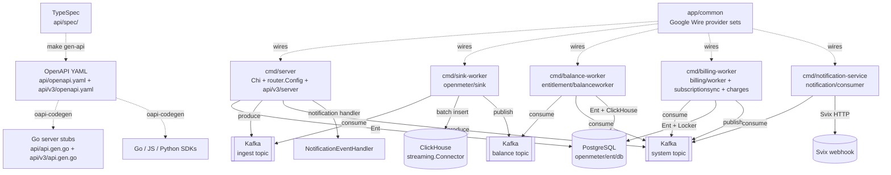

# CLAUDE.md

> Architecture guidance for **Unknown Repository**
> Style: Multi-binary Go monolith with shared domain packages under openmeter/. Seven independent cmd/* binaries are wired via Google Wire provider sets in app/common. The HTTP API is dual-versioned: v1 via openmeter/server/router (Chi + kin-openapi, implements api/api.gen.go) and v3 via api/v3/server (Chi + oasmiddleware, implements api/v3/api.gen.go). Both API stubs are generated from TypeSpec source in api/spec/ via oapi-codegen. Persistence is PostgreSQL via Ent ORM; analytics queries run against ClickHouse; Kafka is the async event bus for ingest, cross-worker communication, and internal domain events routed via Watermill. Migrations are generated by Atlas from Ent schemas into tools/migrate/migrations/.
> Generated: 2026-04-28T18:34:32.534751+00:00

## Overview

OpenMeter is a Go-based metering and billing platform that produces seven deployable binaries (server, billing-worker, balance-worker, sink-worker, notification-service, jobs, benthos-collector) from a single monorepo. All binaries share domain packages under openmeter/ assembled via Google Wire DI in app/common. The HTTP surface is authored in TypeSpec (api/spec/) compiled to OpenAPI YAML and then to Go stubs (api/api.gen.go, api/v3/api.gen.go); the v1 router delegates to typed httpdriver packages and the v3 server assembles handler structs in api/v3/server/. PostgreSQL via Ent ORM is the system of record with Atlas-managed migrations; ClickHouse stores usage events for meter queries; Kafka via Watermill routes ingest, balance-recalculation, and billing system events across workers. Domain packages follow a strict service-interface / adapter-implementation / httpdriver-transport layering with cross-domain callbacks mediated by ServiceHooks and RequestValidator registries to avoid circular imports.

## Architecture

**Style:** Single Go monorepo producing seven deployable binaries (cmd/server, cmd/billing-worker, cmd/balance-worker, cmd/sink-worker, cmd/notification-service, cmd/jobs, cmd/benthos-collector). All binaries share the same domain packages under openmeter/ with strict service/adapter/httpdriver layering, are wired via Google Wire provider sets concentrated in app/common, expose a contract-first HTTP API authored in TypeSpec under api/spec/ that compiles to dual API versions (v1 via api/api.gen.go + openmeter/server/router, v3 via api/v3/api.gen.go + api/v3/handlers), persist to PostgreSQL via Ent ORM with Atlas-managed migrations, query usage from ClickHouse via streaming.Connector, and exchange domain events over Kafka via Watermill with three named topics (ingest, system, balance-worker) routed by event-name prefix in openmeter/watermill/eventbus.
**Structure:** modular

OpenMeter must support high-volume per-tenant usage metering feeding strict billing correctness with stable multi-language SDKs (Go/JS/Python). Ingest, balance recalculation, billing advancement, and notification dispatch have very different scaling profiles and failure modes, so they need to be independently deployable and scalable. At the same time billing correctness across charges, ledger, and invoices requires a single typed domain model. Multi-binary + shared domain packages preserves the single type system; Wire makes binary-specific provider graphs compile-time verified (cmd/server/main.go calls initializeApplication with ~40 service fields aggregated into router.Config); TypeSpec-as-source eliminates SDK drift across languages; Ent+Atlas keeps schema and Go types coupled with deterministic migration diffs; Kafka+Watermill decouples sink-worker from balance-worker from billing-worker so each can replay and scale independently.

**Root constraint:** OpenMeter must provide high-volume per-tenant usage metering feeding strict billing correctness, with stable multi-language SDKs
- → Multi-binary deployment with shared domain packages
- → TypeSpec as the API source of truth for v1 and v3
- → Ent ORM + Atlas migrations as the schema pipeline
- → credits.enabled guarded at four independent wiring layers
- → Dynamic build tag (-tags=dynamic) for librdkafka

**Key trade-offs:**
- Ent-generated query friction — large openmeter/ent/db/ tree, slower compile when adding entities, boilerplate for every adapter (Tx/WithTx/Self triad) → Compile-time-checked relations across ~60 entities, automatic Atlas diffing, no runtime schema surprises, ctx-propagated transactions with savepoint nesting
- Multi-binary orchestration cost — seven Docker image variants, Helm values complexity, multi-service docker-compose, separate Wire graphs per binary → Independent horizontal scaling of sink-worker / balance-worker / billing-worker; fault isolation per binary; isolated deploy cadence
- Two-step regen cadence — TypeSpec changes require `make gen-api` AND `make generate`; multiple generators (TypeSpec, Ent, Wire, Goverter, Goderive) write different artifacts → Cross-language SDK contracts cannot drift; Go server stubs, Go SDK, JS SDK, Python SDK all originate from a single TypeSpec source

**Runs on:** Linux containers (Alpine-based Docker images), deployable on Kubernetes via Helm charts or locally via Docker Compose
**Compute:** cmd/server — Main HTTP API server (openmeter binary in Docker image), cmd/sink-worker — Kafka->ClickHouse sink worker (openmeter-sink-worker binary), cmd/balance-worker — Entitlement balance recalculation worker (openmeter-balance-worker binary), cmd/billing-worker — Billing lifecycle worker (openmeter-billing-worker binary), cmd/notification-service — Webhook/notification dispatcher (openmeter-notification-service binary), cmd/jobs — Admin CLI for one-off jobs (openmeter-jobs binary), cmd/benthos-collector — Benthos event pipeline (separate benthos binary and Docker image)
**CI/CD:** ci.yaml — Build, lint (go/api-spec/openapi/helm), test, e2e on every push/PR; uses Nix .#ci shell on Depot runners, release.yaml — Publishes Docker images to GHCR, Helm charts to GHCR OCI, npm @openmeter/sdk, Python SDK on version tags; JS SDK beta on main push, artifacts.yaml — Reusable workflow: builds and pushes container image to GHCR using Depot depot-build-push-action; multi-platform (linux/amd64, linux/arm64), npm-release.yaml — Reusable workflow: publishes @openmeter/sdk to npm via OIDC trusted publishing, pr-checks.yaml — Enforces release-note label on every PR (minimum 1 of: release-note/ignore, kind/feature, release-note/bug-fix, etc.), security.yaml — Trufflehog secret scanning + SCA (syft) + GitHub workflow scan on PRs and main pushes; fail_on_findings=true, analysis-scorecard.yaml — OpenSSF Scorecard analysis weekly (Fridays) and on main push, sdk-python-dev-release.yaml — Python SDK beta release on main push and workflow_dispatch, require-all-reviewers.yml — Enforces all requested reviewers approve when PR has 'require-all-reviewers' label, workflow-result.yaml — Reusable required-check pass/fail aggregator, untrusted-artifacts.yaml — Reusable workflow: builds container image without publishing (PR safety)

## Architecture Diagram



## Commands

```bash
# up
docker compose up -d
# fmt
golangci-lint run --fix
# test
POSTGRES_HOST=127.0.0.1 go test -p 128 -parallel 16 -tags=dynamic ./...
# lint
make lint-go lint-api-spec lint-openapi lint-helm
# build
go build -o build/ -tags=dynamic ./cmd/...
# server
air -c ./cmd/server/.air.toml
# lint-go
golangci-lint run -v ./...
# test-all
docker compose up -d postgres svix redis && SVIX_HOST=localhost go test -p 128 -parallel 16 -tags=dynamic -count=1 ./...
```

_Full catalog (41 commands) in [`.claude/rules/technology.md`](.claude/rules/technology.md)._

## Architectural Rules

Detailed rules live as topic files under `.claude/rules/`. Read the relevant one when the task touches that surface:

- [`.claude/rules/architecture.md`](.claude/rules/architecture.md) — Components, file placement, naming conventions
- [`.claude/rules/patterns.md`](.claude/rules/patterns.md) — Communication patterns, integrations, key decisions, trade-offs (with violation signals)
- [`.claude/rules/technology.md`](.claude/rules/technology.md) — Tech stack, project structure, code templates, testing tooling
- [`.claude/rules/guidelines.md`](.claude/rules/guidelines.md) — Implementation guidelines for existing capabilities
- [`.claude/rules/pitfalls.md`](.claude/rules/pitfalls.md) — Documented traps with evidence + fix direction
- [`.claude/rules/dev-rules.md`](.claude/rules/dev-rules.md) — Coding-time imperatives (patterns, anti-patterns, boundaries, wiring)
- [`.claude/rules/infrastructure.md`](.claude/rules/infrastructure.md) — CI / signing / distribution / secrets / env setup / registry auth
- [`.claude/rules/enforcement.md`](.claude/rules/enforcement.md) — Every rule the pre-edit hook + plan/commit classifier consults, grouped by severity

## Enforcement Rules

[`.claude/rules/enforcement.md`](.claude/rules/enforcement.md) lists every rule the pre-edit hook (`PRE_VALIDATE_HOOK`) and plan/commit classifier (`align_check.py`) consult, grouped by severity. The underlying source on disk is [`.archie/rules.json`](.archie/rules.json) (project-specific) plus [`.archie/platform_rules.json`](.archie/platform_rules.json) (universal anti-patterns shipped with Archie).

## Per-folder Context

Every meaningful folder has its own `CLAUDE.md` (Archie's intent layer). Claude Code auto-loads the nearest one, so when editing a file under `some/component/`, look there first for the local invariants, anti-patterns, and adjacent code that uses the same shape.

---
*Auto-generated from structured architecture analysis. Place in project root.*

<!-- archie:generated:start -->
<!-- Regenerated by Archie on 2026-04-28T18:41Z. Edits between the archie:generated markers will be overwritten; edit outside them to keep changes. -->

# CLAUDE.md

> Architecture guidance for **Unknown Repository**
> Style: Multi-binary Go monolith with shared domain packages under openmeter/. Seven independent cmd/* binaries are wired via Google Wire provider sets in app/common. The HTTP API is dual-versioned: v1 via openmeter/server/router (Chi + kin-openapi, implements api/api.gen.go) and v3 via api/v3/server (Chi + oasmiddleware, implements api/v3/api.gen.go). Both API stubs are generated from TypeSpec source in api/spec/ via oapi-codegen. Persistence is PostgreSQL via Ent ORM; analytics queries run against ClickHouse; Kafka is the async event bus for ingest, cross-worker communication, and internal domain events routed via Watermill. Migrations are generated by Atlas from Ent schemas into tools/migrate/migrations/.
> Generated: 2026-04-28T18:41:06.319151+00:00

## Overview

OpenMeter is a Go-based metering and billing platform that produces seven deployable binaries (server, billing-worker, balance-worker, sink-worker, notification-service, jobs, benthos-collector) from a single monorepo. All binaries share domain packages under openmeter/ assembled via Google Wire DI in app/common. The HTTP surface is authored in TypeSpec (api/spec/) compiled to OpenAPI YAML and then to Go stubs (api/api.gen.go, api/v3/api.gen.go); the v1 router delegates to typed httpdriver packages and the v3 server assembles handler structs in api/v3/server/. PostgreSQL via Ent ORM is the system of record with Atlas-managed migrations; ClickHouse stores usage events for meter queries; Kafka via Watermill routes ingest, balance-recalculation, and billing system events across workers. Domain packages follow a strict service-interface / adapter-implementation / httpdriver-transport layering with cross-domain callbacks mediated by ServiceHooks and RequestValidator registries to avoid circular imports.

## Architecture

**Style:** Single Go monorepo producing seven deployable binaries (cmd/server, cmd/billing-worker, cmd/balance-worker, cmd/sink-worker, cmd/notification-service, cmd/jobs, cmd/benthos-collector). All binaries share the same domain packages under openmeter/ with strict service/adapter/httpdriver layering, are wired via Google Wire provider sets concentrated in app/common, expose a contract-first HTTP API authored in TypeSpec under api/spec/ that compiles to dual API versions (v1 via api/api.gen.go + openmeter/server/router, v3 via api/v3/api.gen.go + api/v3/handlers), persist to PostgreSQL via Ent ORM with Atlas-managed migrations, query usage from ClickHouse via streaming.Connector, and exchange domain events over Kafka via Watermill with three named topics (ingest, system, balance-worker) routed by event-name prefix in openmeter/watermill/eventbus.
**Structure:** modular

OpenMeter must support high-volume per-tenant usage metering feeding strict billing correctness with stable multi-language SDKs (Go/JS/Python). Ingest, balance recalculation, billing advancement, and notification dispatch have very different scaling profiles and failure modes, so they need to be independently deployable and scalable. At the same time billing correctness across charges, ledger, and invoices requires a single typed domain model. Multi-binary + shared domain packages preserves the single type system; Wire makes binary-specific provider graphs compile-time verified (cmd/server/main.go calls initializeApplication with ~40 service fields aggregated into router.Config); TypeSpec-as-source eliminates SDK drift across languages; Ent+Atlas keeps schema and Go types coupled with deterministic migration diffs; Kafka+Watermill decouples sink-worker from balance-worker from billing-worker so each can replay and scale independently.

**Root constraint:** OpenMeter must provide high-volume per-tenant usage metering feeding strict billing correctness, with stable multi-language SDKs
- → Multi-binary deployment with shared domain packages
- → TypeSpec as the API source of truth for v1 and v3
- → Ent ORM + Atlas migrations as the schema pipeline
- → credits.enabled guarded at four independent wiring layers
- → Dynamic build tag (-tags=dynamic) for librdkafka

**Key trade-offs:**
- Ent-generated query friction — large openmeter/ent/db/ tree, slower compile when adding entities, boilerplate for every adapter (Tx/WithTx/Self triad) → Compile-time-checked relations across ~60 entities, automatic Atlas diffing, no runtime schema surprises, ctx-propagated transactions with savepoint nesting
- Multi-binary orchestration cost — seven Docker image variants, Helm values complexity, multi-service docker-compose, separate Wire graphs per binary → Independent horizontal scaling of sink-worker / balance-worker / billing-worker; fault isolation per binary; isolated deploy cadence
- Two-step regen cadence — TypeSpec changes require `make gen-api` AND `make generate`; multiple generators (TypeSpec, Ent, Wire, Goverter, Goderive) write different artifacts → Cross-language SDK contracts cannot drift; Go server stubs, Go SDK, JS SDK, Python SDK all originate from a single TypeSpec source

**Runs on:** Linux containers (Alpine-based Docker images), deployable on Kubernetes via Helm charts or locally via Docker Compose
**Compute:** cmd/server — Main HTTP API server (openmeter binary in Docker image), cmd/sink-worker — Kafka->ClickHouse sink worker (openmeter-sink-worker binary), cmd/balance-worker — Entitlement balance recalculation worker (openmeter-balance-worker binary), cmd/billing-worker — Billing lifecycle worker (openmeter-billing-worker binary), cmd/notification-service — Webhook/notification dispatcher (openmeter-notification-service binary), cmd/jobs — Admin CLI for one-off jobs (openmeter-jobs binary), cmd/benthos-collector — Benthos event pipeline (separate benthos binary and Docker image)
**CI/CD:** ci.yaml — Build, lint (go/api-spec/openapi/helm), test, e2e on every push/PR; uses Nix .#ci shell on Depot runners, release.yaml — Publishes Docker images to GHCR, Helm charts to GHCR OCI, npm @openmeter/sdk, Python SDK on version tags; JS SDK beta on main push, artifacts.yaml — Reusable workflow: builds and pushes container image to GHCR using Depot depot-build-push-action; multi-platform (linux/amd64, linux/arm64), npm-release.yaml — Reusable workflow: publishes @openmeter/sdk to npm via OIDC trusted publishing, pr-checks.yaml — Enforces release-note label on every PR (minimum 1 of: release-note/ignore, kind/feature, release-note/bug-fix, etc.), security.yaml — Trufflehog secret scanning + SCA (syft) + GitHub workflow scan on PRs and main pushes; fail_on_findings=true, analysis-scorecard.yaml — OpenSSF Scorecard analysis weekly (Fridays) and on main push, sdk-python-dev-release.yaml — Python SDK beta release on main push and workflow_dispatch, require-all-reviewers.yml — Enforces all requested reviewers approve when PR has 'require-all-reviewers' label, workflow-result.yaml — Reusable required-check pass/fail aggregator, untrusted-artifacts.yaml — Reusable workflow: builds container image without publishing (PR safety)

## Architecture Diagram


## Commands

```bash
# up
docker compose up -d
# fmt
golangci-lint run --fix
# test
POSTGRES_HOST=127.0.0.1 go test -p 128 -parallel 16 -tags=dynamic ./...
# lint
make lint-go lint-api-spec lint-openapi lint-helm
# build
go build -o build/ -tags=dynamic ./cmd/...
# server
air -c ./cmd/server/.air.toml
# lint-go
golangci-lint run -v ./...
# test-all
docker compose up -d postgres svix redis && SVIX_HOST=localhost go test -p 128 -parallel 16 -tags=dynamic -count=1 ./...
```

_Full catalog (41 commands) in [`.claude/rules/technology.md`](.claude/rules/technology.md)._

## Architectural Rules

Detailed rules live as topic files under `.claude/rules/`. Read the relevant one when the task touches that surface:

- [`.claude/rules/architecture.md`](.claude/rules/architecture.md) — Components, file placement, naming conventions
- [`.claude/rules/patterns.md`](.claude/rules/patterns.md) — Communication patterns, integrations, key decisions, trade-offs (with violation signals)
- [`.claude/rules/technology.md`](.claude/rules/technology.md) — Tech stack, project structure, code templates, testing tooling
- [`.claude/rules/guidelines.md`](.claude/rules/guidelines.md) — Implementation guidelines for existing capabilities
- [`.claude/rules/pitfalls.md`](.claude/rules/pitfalls.md) — Documented traps with evidence + fix direction
- [`.claude/rules/dev-rules.md`](.claude/rules/dev-rules.md) — Coding-time imperatives (patterns, anti-patterns, boundaries, wiring)
- [`.claude/rules/infrastructure.md`](.claude/rules/infrastructure.md) — CI / signing / distribution / secrets / env setup / registry auth
- [`.claude/rules/enforcement.md`](.claude/rules/enforcement.md) — Every rule the pre-edit hook + plan/commit classifier consults, grouped by severity

## Enforcement Rules

[`.claude/rules/enforcement.md`](.claude/rules/enforcement.md) lists every rule the pre-edit hook (`PRE_VALIDATE_HOOK`) and plan/commit classifier (`align_check.py`) consult, grouped by severity. The underlying source on disk is [`.archie/rules.json`](.archie/rules.json) (project-specific) plus [`.archie/platform_rules.json`](.archie/platform_rules.json) (universal anti-patterns shipped with Archie).

## Per-folder Context

Every meaningful folder has its own `CLAUDE.md` (Archie's intent layer). Claude Code auto-loads the nearest one, so when editing a file under `some/component/`, look there first for the local invariants, anti-patterns, and adjacent code that uses the same shape.

---
*Auto-generated from structured architecture analysis. Place in project root.*
<!-- archie:generated:end -->
