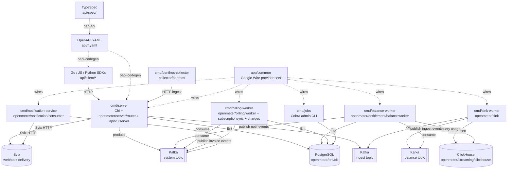

# OpenMeter Development Guide

See consolidated agents instructions in @AGENTS.md

<!-- archie:generated:start -->
<!-- Regenerated by Archie on 2026-04-24T11:31Z. Edits between the archie:generated markers will be overwritten; edit outside them to keep changes. -->

# CLAUDE.md

> Architecture guidance for **Unknown Repository**
> Style: Multi-binary Go monolith with domain-per-package organization. Seven independent binaries (server, billing-worker, balance-worker, sink-worker, notification-service, jobs, benthos-collector) share domain packages under openmeter/ assembled via Google Wire dependency injection in app/common. HTTP API is dual-versioned (v1 via api/api.gen.go + openmeter/server/router, v2/v3 via api/v3/), both generated from a TypeSpec source. Persistence is PostgreSQL through Ent ORM; analytics queries run against ClickHouse. Kafka is the event bus for ingest, cross-worker communication, and internal system events routed via Watermill.
> Generated: 2026-04-24T11:31:15.073372+00:00

## Overview

OpenMeter is a Go-based metering and billing platform organized as a monorepo producing seven deployable binaries that share a large set of domain packages. The domain layer (openmeter/) is strictly layered: each major domain exposes a Go interface (Service, Connector, or FeatureConnector), has a hand-written Ent/PostgreSQL adapter, and optionally an httpdriver or httphandler package that adapts the service interface to HTTP handlers using a generic httptransport.Handler[Request,Response] pattern. Application-level dependency wiring lives exclusively in app/common using Google Wire provider sets; each cmd/* binary calls a Wire-generated initializeApplication to get a fully wired app struct. The API surface is defined in TypeSpec (api/spec/) and compiled to OpenAPI YAML and then to Go server stubs via oapi-codegen; the v1 server (openmeter/server/router) and v3 server (api/v3/server) are separate packages, both generated from their respective specs. Database schema is owned by Ent (openmeter/ent/schema/) and migrations are generated by Atlas into tools/migrate/migrations/ as golang-migrate .up/.down SQL files.

## Architecture

**Style:** A single Go monorepo producing seven deployable binaries (cmd/server, cmd/billing-worker, cmd/balance-worker, cmd/sink-worker, cmd/notification-service, cmd/jobs, cmd/benthos-collector) that all import the same domain packages under openmeter/. Binaries are assembled via Google Wire provider sets in app/common. Kafka (via Watermill + confluent-kafka-go) is the cross-binary event bus (ingest, system, balance topics). Postgres through Ent ORM is the system of record; ClickHouse is the analytics/usage store. HTTP is served by Chi with OpenAPI stubs generated from TypeSpec (api/spec/) into both v1 (openmeter/server/router + api/api.gen.go) and v3 (api/v3/server + api/v3/api.gen.go).
**Structure:** modular

Shared domain code with independent deployables lets OpenMeter scale hot paths (ingest sink, balance recalculation, billing advancement) horizontally and isolate failure domains while keeping a single compile-time type system for billing correctness. TypeSpec as single source-of-truth lets one spec drive Go server stubs + Go client + JavaScript SDK + Python SDK without drift. Ent + Atlas ties schema to typed Go code with deterministic migration generation. Watermill decouples domain event producers from consumers so the billing-worker / balance-worker / notification-service can evolve independently.

**Root constraint:** OpenMeter must provide high-volume per-tenant usage metering feeding strict billing correctness, with stable multi-language SDKs.
- → Multi-binary deployment with shared domain packages
- → TypeSpec as the API source of truth
- → Ent ORM + Atlas migrations
- → credits.enabled guarded at multiple wiring layers

**Key trade-offs:**
- Ent-generated query friction (longer compile on schema change, boilerplate in openmeter/ent/db/) → Compile-time-checked relations across ~60 entities, automatic Atlas diffing, no runtime schema surprises
- Multi-binary orchestration cost (Docker images, Helm values, local docker-compose) and operational complexity → Horizontal scaling of sink-worker / balance-worker / billing-worker independent of HTTP traffic; fault isolation per binary
- Two-step regen cadence: TypeSpec -> `make gen-api`, then `make generate` for Go server/wire/ent → Stable cross-language SDK contracts; contract drift is impossible as long as both steps run

**Runs on:** Linux containers (Alpine-based Docker images), deployable on Kubernetes via Helm charts or locally via Docker Compose
**Compute:** ghcr.io/openmeterio/openmeter (main API server + all workers in single image), ghcr.io/openmeterio/benthos-collector (benthos-collector binary image)
**CI/CD:** .github/workflows/ci.yaml — build, lint (go/api-spec/openapi/helm), test, e2e on every push/PR; uses Nix .#ci shell on Depot runners, .github/workflows/release.yaml — publishes Docker images, Helm charts, npm @openmeter/sdk, Python SDK on version tags; JS SDK beta on main push, .github/workflows/artifacts.yaml — reusable workflow: builds and pushes container image to GHCR using Depot depot-build-push-action; signs with cosign, .github/workflows/npm-release.yaml — reusable workflow: publishes @openmeter/sdk to npm via OIDC trusted publishing, .github/workflows/pr-checks.yaml — enforces release-note label on PRs, .github/workflows/security.yaml — Trufflehog secret scanning on PRs and main pushes, .github/workflows/analysis-scorecard.yaml — OpenSSF Scorecard analysis weekly and on main push, .github/workflows/sdk-python-dev-release.yaml — Python SDK beta release on main push, .github/workflows/require-all-reviewers.yml — enforces all requested reviewers approve before merge, .github/workflows/workflow-result.yaml — reusable required-check pass/fail aggregator, .github/workflows/untrusted-artifacts.yaml — reusable workflow: builds container image without publishing (PR safety)

## Architecture Diagram



## Commands

```bash
# up
docker compose up -d
# down
docker compose down --remove-orphans --volumes
# server
air -c ./cmd/server/.air.toml
# sink-worker
air -c ./cmd/sink-worker/.air.toml
# balance-worker
air -c ./cmd/balance-worker/.air.toml
# billing-worker
air -c ./cmd/billing-worker/.air.toml
# notification-service
air -c ./cmd/notification-service/.air.toml
# build
go build -o build/ -tags=dynamic ./cmd/...
# build-server
go build -o build/server -tags=dynamic ./cmd/server
# build-sink-worker
go build -o build/sink-worker -tags=dynamic ./cmd/sink-worker
# build-balance-worker
go build -o build/balance-worker -tags=dynamic ./cmd/balance-worker
# build-billing-worker
go build -o build/billing-worker -tags=dynamic ./cmd/billing-worker
# build-notification-service
go build -o build/notification-service -tags=dynamic ./cmd/notification-service
# build-jobs
go build -o build/jobs -tags=dynamic ./cmd/jobs
# build-benthos-collector
go build -o build/benthos-collector -tags=dynamic ./cmd/benthos-collector
# test
POSTGRES_HOST=127.0.0.1 go test -p 128 -parallel 16 -tags=dynamic ./...
# test-nocache
POSTGRES_HOST=127.0.0.1 go test -p 128 -parallel 16 -tags=dynamic -count=1 ./...
# test-all
docker compose up -d postgres svix redis && SVIX_HOST=localhost go test -p 128 -parallel 16 -tags=dynamic -count=1 ./...
# etoe
make -C e2e test-local
# etoe-slow
RUN_SLOW_TESTS=1 make -C e2e test-local
# lint
make lint-go lint-api-spec lint-openapi lint-helm
# lint-go
golangci-lint run -v ./...
# lint-go-fast
golangci-lint run -v --config .golangci-fast.yaml ./...
# lint-go-style
golangci-lint fmt -v -d ./...
# lint-api-spec
make -C api/spec lint
# lint-openapi
spectral lint api/openapi.yaml api/openapi.cloud.yaml api/v3/openapi.yaml
# lint-helm
helm lint deploy/charts/openmeter && helm lint deploy/charts/benthos-collector
# fmt
golangci-lint run --fix
# mod
go mod tidy
# generate
go generate ./...
# generate-all
make update-openapi generate-javascript-sdk && go generate ./...
# gen-api
make update-openapi generate-javascript-sdk
# update-openapi
make -C api/spec generate && go generate ./api/...
# generate-view-sql
go run ./tools/migrate/cmd/viewgen
# migrate-check
make migrate-check-schema migrate-check-diff migrate-check-lint migrate-check-validate
# migrate-diff
atlas migrate --env local diff <migration-name>
# migrate-check-validate
atlas migrate --env local validate
# migrate-check-lint
atlas migrate --env local lint --latest 10
# seed
benthos -c etc/seed/seed.yaml
# llm-cost-sync
go run ./cmd/jobs llm-cost sync
# package-helm-chart
helm package deploy/charts/<CHART> --version <VERSION> --destination build/helm
```

## Key Rules

Detailed architecture rules are split into topic files under `.claude/rules/`:

- `architecture.md` — Components, file placement, naming conventions
- `patterns.md` — Communication patterns, key decisions
- `guidelines.md` — Implementation guidelines
- `pitfalls.md` — Common pitfalls, error mapping
- `dev-rules.md` — Development rules (always/never imperatives)
- `frontend.md` — Frontend rules (when applicable)

---
*Auto-generated from structured architecture analysis. Place in project root.*
<!-- archie:generated:end -->
