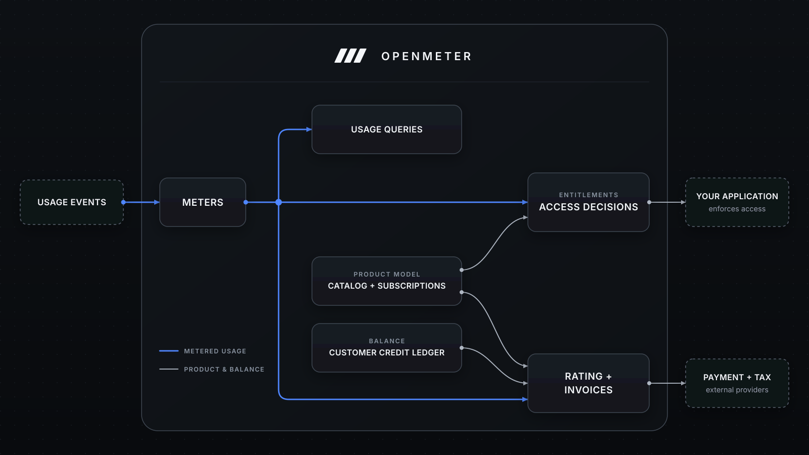

<div align="center">

<a href="https://openmeter.io">
  
</a>

# OpenMeter

**Meter usage. Enforce access. Bill customers. Keep the stack yours.**

OpenMeter is open-source monetization infrastructure built for AI, API, and
usage-based products. It turns high-volume events into real-time usage, powers
access enforcement, and handles usage-based billing from pricing and
subscriptions through credits and invoices.

API-first and composable, it can own the path from raw usage to invoice—or only
the parts your stack is missing—and work with the payment and tax providers you
already use.

[Quickstart](#quickstart) ·
[Documentation](https://openmeter.io/docs) ·
[API reference](https://openmeter.io/docs/api/open-source) ·
[Community](https://github.com/openmeterio/openmeter/discussions)

[](https://github.com/openmeterio/openmeter/releases/latest)
[](https://github.com/openmeterio/openmeter/actions/workflows/ci.yaml)
[](LICENSE)

</div>

## How it fits together



## Is OpenMeter a fit?

| Question | Answer |
| --- | --- |
| **What is it best for?** | Products with usage-based or hybrid pricing, prepaid credits, or usage limits that need one source of truth for consumption. |
| **What is it not?** | A bundled operator UI, payment processor, tax engine, or general-purpose accounting system. If you only need fixed recurring subscriptions, a direct payment-provider integration is usually simpler. |
| **Who enforces access?** | OpenMeter calculates balances and access decisions; your application acts on the result. |
| **How mature is it?** | Releases are beta and can include breaking changes. The [OpenMeter metering engine](https://openmeter.io/) has run in production for years and processed billions of usage events. Review [releases](https://github.com/openmeterio/openmeter/releases) and [migration guides](docs/migration-guides) when upgrading. |

## What OpenMeter provides

| Capability | What it covers |
| --- | --- |
| **[Meter usage](https://openmeter.io/docs/metering/overview)** | Ingest CloudEvents, attribute usage to customers, aggregate it in real time, and query it by time window or dimension. |
| **[Model products and pricing](https://openmeter.io/docs/product-catalog/overview)** | Define versioned plans, features, add-ons, and flat, recurring, per-unit, tiered, package, or dynamic prices; then assign customer subscriptions. |
| **[Control access](https://openmeter.io/docs/billing/entitlements/overview)** | Calculate feature access and usage-limit balances for your application to enforce, with one-time or recurring entitlement grants. |
| **[Bill usage](https://openmeter.io/docs/billing/overview)** | Rate flat and usage-based charges, manage customer credit balances and subscription changes, and run the invoice lifecycle. |
| **[Integrate](https://openmeter.io/docs/api/open-source)** | Use the OSS REST API and JavaScript, Python, or Go SDKs, send webhooks, and connect external invoicing providers. |

## Quickstart

The local evaluation stack requires [Git](https://git-scm.com/) and
[Docker with Compose](https://docs.docker.com/compose/). Use `curl`, Node.js
22+, or Python 3.9+ for the examples below.

```sh
git clone https://github.com/openmeterio/openmeter.git
cd openmeter/quickstart
docker compose up -d --wait
```

The stack includes an `api_requests_total` meter. Choose a client below; each
example sends one `request` event and queries its metered value.

<details open>
<summary><strong>Bash (curl)</strong></summary>

```sh
curl -sS -o /dev/null -w '%{http_code}\n' \
  -X POST http://localhost:48888/api/v1/events \
  -H 'Content-Type: application/cloudevents+json' \
  --data-raw '{
    "specversion": "1.0",
    "type": "request",
    "id": "readme-curl-1",
    "source": "readme",
    "subject": "readme-curl",
    "data": { "method": "GET", "route": "/hello" }
  }'

response=
for attempt in 1 2 3 4 5 6 7 8 9 10; do
  response=$(curl -fsS 'http://localhost:48888/api/v1/meters/api_requests_total/query?subject=readme-curl')
  printf '%s' "$response" | grep -q '"value":1' && break
  sleep 1
done
printf '%s\n' "$response"
```

</details>

<details>
<summary><strong>TypeScript SDK</strong></summary>

Install the [OpenMeter TypeScript SDK](https://www.npmjs.com/package/@openmeter/sdk):

```sh
npm install @openmeter/sdk tsx
```

Save as `quickstart.ts`, then run `npx tsx quickstart.ts`:

```ts
import { OpenMeter } from '@openmeter/sdk'

const openmeter = new OpenMeter({ baseUrl: 'http://localhost:48888' })

const queryUsage = () =>
  openmeter.meters.query('api_requests_total', {
    subject: ['readme-typescript'],
  })

async function main() {
  await openmeter.events.ingest({
    type: 'request',
    id: 'readme-typescript-1',
    source: 'readme',
    subject: 'readme-typescript',
    data: { method: 'GET', route: '/hello' },
  })

  let usage = await queryUsage()
  for (let attempt = 1; usage.data[0]?.value !== 1 && attempt < 10; attempt++) {
    await new Promise((resolve) => setTimeout(resolve, 1000))
    usage = await queryUsage()
  }

  if (usage.data[0]?.value !== 1) {
    throw new Error('usage was not processed in time')
  }
  console.log(usage.data[0].value)
}

main().catch((error) => {
  console.error(error)
  process.exitCode = 1
})
```

</details>

<details>
<summary><strong>Python SDK</strong></summary>

The Python SDK is in preview, so install it with pre-releases enabled:

```sh
python -m pip install --pre openmeter
```

Save as `quickstart.py`, then run `python quickstart.py`:

```python
import time

from openmeter import Client
from openmeter.models import Event

with Client(endpoint="http://localhost:48888") as openmeter:
    openmeter.events.ingest_event(
        Event(
            id="readme-python-1",
            source="readme",
            specversion="1.0",
            type="request",
            subject="readme-python",
            data={"method": "GET", "route": "/hello"},
        )
    )

    for _ in range(10):
        usage = openmeter.meters.query_json(
            "api_requests_total",
            subject=["readme-python"],
        )
        if usage.data and usage.data[0].value == 1:
            break
        time.sleep(1)
    else:
        raise RuntimeError("usage was not processed in time")

    print(usage.data[0].value)
```

</details>

Event processing is asynchronous. A successful example ends with a metered
value of `1`.

> [!NOTE]
> This Compose setup is a local evaluation stack. It runs the OpenMeter API and
> workers together with Kafka, ClickHouse, PostgreSQL, Redis, and Svix using
> `latest` OpenMeter images; it is not a production topology.

Continue with the [full OSS quickstart](quickstart/README.md), try a
[metering example](https://openmeter.io/docs/metering/guides/common-examples),
add [entitlements and usage limits](https://openmeter.io/docs/billing/entitlements/quickstart),
or model [plans and subscriptions](https://openmeter.io/docs/product-catalog/overview).

When you are done, remove the containers and their local data volumes:

```sh
docker compose down -v
```

## Running OpenMeter

The core runtime is OpenMeter's API and worker processes plus Kafka,
ClickHouse, and PostgreSQL. Redis is optional for distributed deduplication and
query progress; Svix is used when webhook delivery is enabled. The
[architecture guide](https://openmeter.io/docs/open-source/architecture)
explains the complete runtime and data flow.

For production, use the official
[Helm chart for Kubernetes](https://openmeter.io/docs/open-source/kubernetes),
operate stateful dependencies outside the chart, enable optional services for
the capabilities you use, and pin OpenMeter to a release instead of `latest`.

## Project and community

| Need | Go to |
| --- | --- |
| Ask a question or discuss an approach | [GitHub Discussions](https://github.com/openmeterio/openmeter/discussions) |
| Report a reproducible bug or request a feature | [GitHub Issues](https://github.com/openmeterio/openmeter/issues) |
| Track changes | [Releases](https://github.com/openmeterio/openmeter/releases) and [migration guides](docs/migration-guides) |
| Report a vulnerability | [Security policy](SECURITY.md) |
| Build or contribute | [Contributing guide](CONTRIBUTING.md) and [Code of Conduct](CODE_OF_CONDUCT.md) |

## License

OpenMeter is licensed under the [Apache License 2.0](LICENSE).
