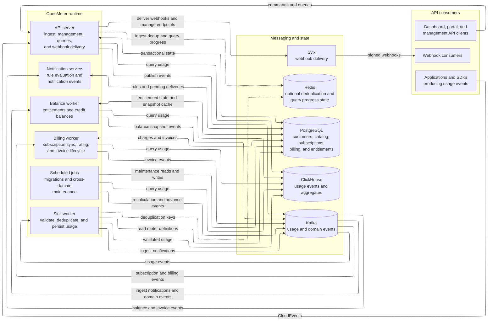

# Architecture

OpenMeter separates high-volume usage data from transactional application state.
The following diagram shows the primary runtime components and data flows; it omits observability and deployment-specific infrastructure.
The diagram requests the ELK layout engine; renderers without it installed (such as github.com) fall back to the default dagre layout with the same content.

Kafka decouples event ingestion from asynchronous processing. ClickHouse stores and aggregates usage data, while PostgreSQL remains the source of truth for transactional product and billing state. Dashed edges are optional, configuration-dependent flows: event deduplication is disabled by default and uses an in-process memory store unless the Redis driver is configured, and the API server can additionally use Redis for ingest-side deduplication and for tracking long-running query progress. The notification service evaluates rules and records pending notification events; actual webhook delivery to Svix runs as a leader-elected reconciler inside the API server. A separate optional Collector component (`collector/`) can buffer and forward events from external sources to the ingest API.
