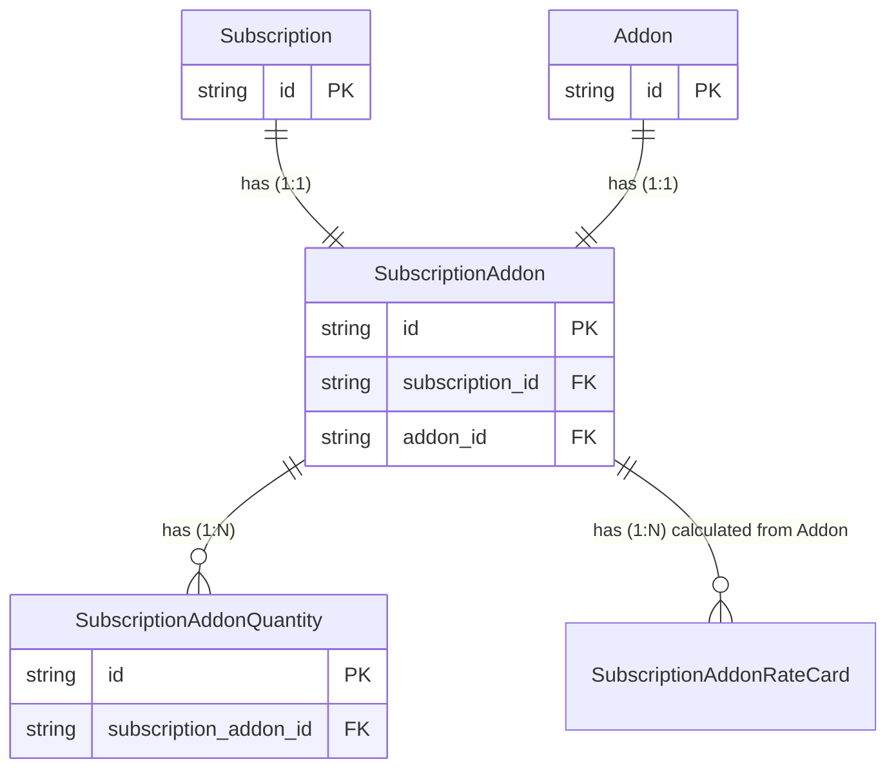

# Subscription Addon

This package contains the subscription addon related functionality.

## Entity Relationship Diagram

## Quirks

1. **Feature resolution**: When an addon creates a new SubscriptionItem (not a split of an existing one but a new item), the featureKey => feature resolution will happen at sync time. This means, that potentially, in a subscription, items with the same featureKey reference can point to different feature instances.