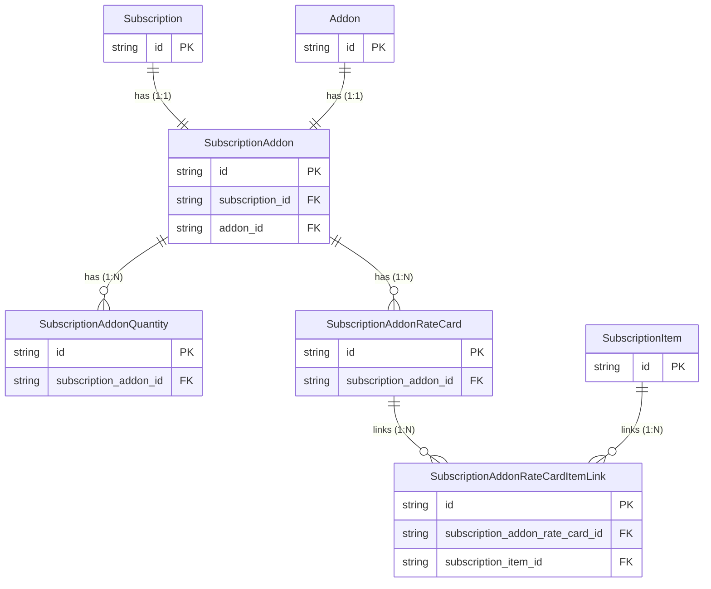

# Subscription Addon

This package contains the subscription addon related functionality.

## Entity Relationship Diagram

```mermaid
erDiagram
    Subscription ||--|| SubscriptionAddon : "has (1:1)"
    SubscriptionAddon ||--o{ SubscriptionAddonQuantity : "has (1:N)"
    SubscriptionAddon ||--o{ SubscriptionAddonRateCard : "has (1:N)"
    SubscriptionAddonRateCard ||--o{ SubscriptionAddonRateCardItemLink : "links (1:N)"
    SubscriptionItem ||--o{ SubscriptionAddonRateCardItemLink : "links (1:N)"
    Addon ||--|| SubscriptionAddon : "has (1:1)"

    Subscription {
        string id PK
    }

    Addon {
        string id PK
    }

    SubscriptionAddon {
        string id PK
        string subscription_id FK
        string addon_id FK
    }

    SubscriptionAddonQuantity {
        string id PK
        string subscription_addon_id FK
    }

    SubscriptionAddonRateCard {
        string id PK
        string subscription_addon_id FK
    }

    SubscriptionAddonRateCardItemLink {
        string id PK
        string subscription_addon_rate_card_id FK
        string subscription_item_id FK
    }

    SubscriptionItem {
        string id PK
    }
```
